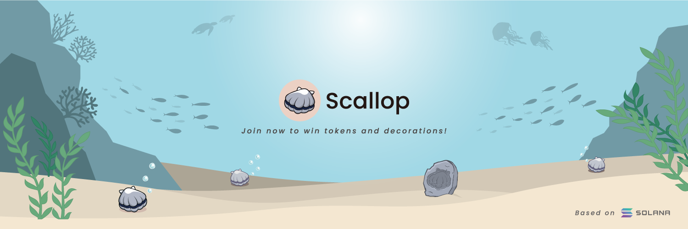

# About Scallop 🦪🍴

## **What is Scallop?**

Scallop is a diverse no-loss protocol on Solana blockchain, it is a finance strategy that maximizes the potential yield with no principal loss. Users can deposit tokens into Scallop Pools, Scallop on-chain program will invoke lending, staking, and stable pool liquidity mining protocols to earn the yield. Every 24 hrs, a winner will be picked from each pool by the on-chain program to get most of the yields as the prize, and other yields will be in the Scallop treasury.

During the participation, users have chances to win extra tokens and Scallop NFTs by carrying out some tasks. We called Scallop NFTs "Scallop Decorations", it's like a small NFTs ecosystem, and Scallop Decorations will show up in Scallop Tank and interact with Scallop protocol.

Linktree🌲 : https://linktr.ee/scallop\_io

