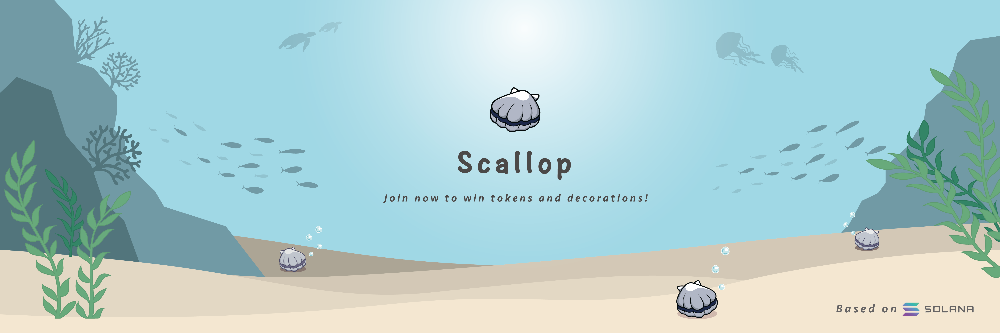

# About Scallop 🦪✨

## **What is Scallop?**

Scallop is a Defi game on Solana, users can stake their SOL here to grow a scallop and have chances to win tokens and NFTs.

At the end of each week, one \(or a few\) of winner chosen by program randomly will share out some Scallop token \(SCA\) with same value of SOL staking reward, 7% of SOL reward will be kept in the staking pool, 93% will be SCA buyback. 

During the game users can win SPL tokens and Scallop Decorations by carrying out some tasks✨!

