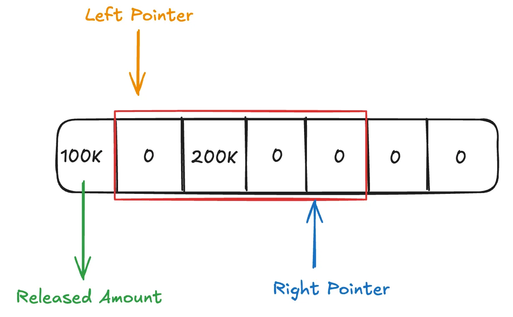

# Core Architecture

<figure><figcaption>
Scallop Lending Architecture
</figcaption></figure>

## Lending Pool

***

Lending pool allow liquidity providers (LPs) to earn interest by depositing assets, with the flexibility to withdraw at any time. When users supply assets to Scallop’s lending pools, they receive **sCoins** in return. **But what exactly are sCoins, and why does Scallop issue them when users make deposits?**

sCoins are tokens that act as proof of a user’s supply at lending pool within the Scallop protocol. Beyond simply representing ownership, these sCoins serve also act as interest-bearing mean the value of sCoins grows overtime as they accrue interest from the deposited assets.

The value of sCoins is determined by both the price of the underlying asset and the current exchange rate. Key details to understand:

* The amount of sCoins you receive upon deposit depends on the current exchange rate.
* As interest builds, the exchange rate rises over time.
* **sCoin price formula**: sCoin price = Underlying asset price × Exchange rate.


For example\
if 1 SUI is worth $1 USD and the sSUI exchange rate is 1.03, the value of each sSUI would be $1.03. Holding sCoins not only signifies ownership of the underlying assets but also the interest earned on them.


## X-Oracle

***

X-Oracle is a service developed by Scallop to **mitigate the risk of price manipulation in lending protocols**. We’ve added an extra layer of security by using multiple oracles to cross-verify prices. If any anomalies are detected in the price data, the operation is halted. A primary oracle provides the main data source, while additional oracles act as an additional data to verify the primary oracle’s accuracy.


Currently, the primary oracle is Pyth, and the secondary oracle is Supra.


In Scallop the X-Oracle service is triggered during borrowing and collateral withdrawal transactions. Additionally, it is utilized when a user’s obligation becomes unhealthy and is eligible for liquidation by a liquidator.

## Obligation

***

An `Obligation` is an object used to record your collateral and debt. Therefore, you need to create at least one `Obligation` to perform any actions related to borrowing.


It’s possible to have multiple obligations.

Each obligation is independent of the others, meaning that depositing collateral in one obligation does not allow you to borrow an asset using another obligation—even if you are the owner of both obligations.


### Undrestanding Obligation in Deep

An `Obligation` is a shared object. instead of holding the `Obligation` object in your wallet, you will possess an `ObligationKey`. This `ObligationKey` serves as proof that you own a specific `Obligation` linked to this **key**. Consequently, what you will find in your wallet is an NFT of the `ObligationKey`.

Essentially, your `Obligation` can be included in any transaction. However, for certain actions that _require proof of ownership_, others cannot use your `Obligation` because the function requires ownership proof. This is where your `ObligationKey` **plays a crucial role**.

For instance, when you want to borrow, the borrowing function will require you to provide both the `Obligation` and `ObligationKey` objects. In this scenario, anyone could pass your `Obligation` in this function, BUT **only you** can use the **correct** `ObligationKey`. This mechanism secures your `Obligation` against unauthorized use.

This is what we leverage from Sui Object-centric Model [https://docs.sui.io/concepts/object-ownership/address-owned](https://docs.sui.io/concepts/object-ownership/address-owned)

## Collateral

***

Collateral is a valuable asset deposited by a borrower to secure a loan. It serves as security for the lender, ensuring that if the borrower fails to repay the loan, the collateral can be liquidated (sold) to recover the loaned amount.

In Scallop, users can deposit collateral, which is recorded in their obligations account. Each deposited asset increases the user’s borrowing capacity. However, before depositing their collateral, users must understand some key Scallop parameters related to collateral pools:

### Collateral Capacity

Collateral Capacity is the total deposit limit for each asset. As long as the collateral cap for an asset hasn’t been reached, users can continue depositing that asset as collateral.

### Collateral Weight

**Collateral weight** is a percentage that shows how much of your collateral’s value you can borrow. It helps manage risk in lending. If the collateral weight is less than 100%, it means you can’t borrow the full value of your collateral, only a portion of it.


Example:

* You deposit 1 BTC, which is worth $10,000.
* If the collateral weight is 70%, you can borrow up to 70% of the BTC’s value, or $7,000.


This limit helps protect the system in case the value of the collateral drops, reducing the risk of liquidation.

You maybe wondering about what kind of formula used by scallop to calculate the collateral values. Your collateral value is determined using this formula:

<figure><figcaption></figcaption></figure>

## Borrowing

***

**Borrowing** is an action where users can take a loan against their collateral assets. When performing this action, users must be aware of certain risks associated with borrowing against their collateral.

In Scallop, there are specific parameters that users need to understand before taking a loan on our protocol. We will dive deeper into these topics so that you can better manage your position risk on Scallop.

### Collateral Weight

You may have already read about this on the collateral side. As mentioned, the collateral weight is the percentage that determines how much a borrower can take as a loan. When borrowing against your collateral, it’s crucial to pay close attention to this parameter. Failing to do so could increase the risk of reaching your liquidation position.

### Borrow Weight

**Borrow weight** is a parameter that adjusts the borrowing capacity of users depending on the volatility of the asset they wish to borrow. Assets with higher volatility will have a higher borrow weight, making it more “expensive” to borrow them, meaning users can borrow a smaller amount compared to more stable assets. This is the formula of how your debt calculated on Scallop.

<figure><figcaption></figcaption></figure>



Example:

if two assets (USDC and SUI) are both priced at $1:

* **USDC**, being a stable asset, might have a borrow weight of 1.
* **SUI**, a more volatile asset, might have a borrow weight of 1.25.

If you have $7,000 in collateral:

* You could borrow 7,000 USDC (7,000 ÷ 1 borrow weight = 7,000).
* But you could only borrow 5,600 SUI (7,000 ÷ 1.25 borrow weight = 5,600).


This system ensures that borrowing volatile assets is more limited, reducing the risk of liquidation due to sudden price fluctuations.

### Borrow Outflow Limit

The **borrow outflow limit** refers to the maximum amount of an asset a user can borrow within a 24-hour period, with new amounts released every 30 minutes.

This is the short example how we calculate released amount:

<figure><figcaption>
Outflow Limit
</figcaption></figure>


Examples:

**Total Borrow Limit (24 hours):** 10 million USDC.

**Initial Condition:** No borrowing has happened yet, so the full 10 million USDC is available.

* A user borrows **100k USDC**.
* Now, the available outflow is **9.9 million USDC**.
* The **100k USDC** will be “released” and available again after **24 hours**.
* If no more borrowing happens, the pool remains at 9.9 million USDC.
* After 24 hours, the **100k USDC** is released and added back, making the total outflow available again **10 million USDC**.
* Then Another user borrows **200k USDC** after an hour. Now, **9.7 million USDC** is available.
* The borrowed **200k USDC** will be released in **24 hours** from when it was borrowed.


> Notes: \
> Right Pointer: The current running time \
> Left Pointer: The latest 2 hours running time

### Borrow Fee

When users decide to take out a loan through the platform, a small fee is applied as part of the borrowing process. Specifically, this fee amounts to 0.3% of the total loan amount. This fee is not an additional charge to the borrower but rather is directly deducted from the loan amount at the time of borrowing.

### Liquidation Factor

The **liquidation factor** sets a threshold for how much debt a user can take against their collateral.


Example:

Liquidation Factor SUI: 0.8 (80%) Liquidation Factor USDC: 0.9 (90%)

if a user has collateral consisting of **100 USDC** and **200$ value of SUI**, the liquidation thresholds are calculated as follows:

* **USDC**: $100 \* 0.9 (90% liquidation factor) = **$90**
* **SUI**: $200 \* 0.8 (80% liquidation factor) = **$160**

This gives a total collateral value of **$250**. If the user’s debt exceeds **$250**, they become eligible for liquidation.


## Soft Liquidation

***

Liquidation is a process where another user can repay the debt of a borrower who has exceeded the maximum allowable debt for their obligation. Liquidation models may vary across protocols, and Scallop’s model differs from others.

In many protocols, when a user’s position becomes unhealthy, they may lose all their collateral to repay the debt. However, in Scallop, this doesn’t happen. When a user’s position becomes unhealthy, only the portion of the debt that caused the user to become unhealthy is liquidated. Once the liquidation brings the user’s position back to a healthy state, no further liquidation can occur. As a result, the user only loses a portion of their collateral, rather than the entire amount, due to the liquidation process.
