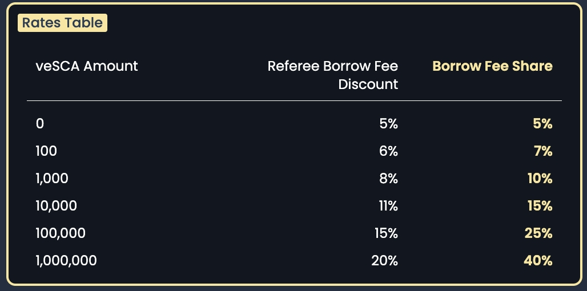
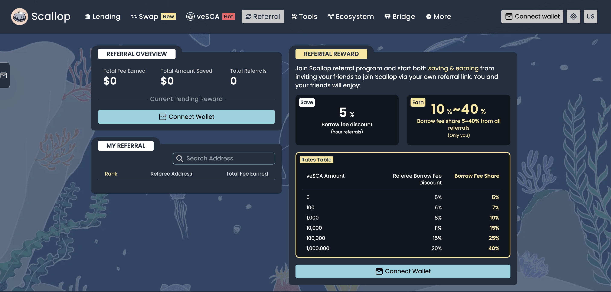
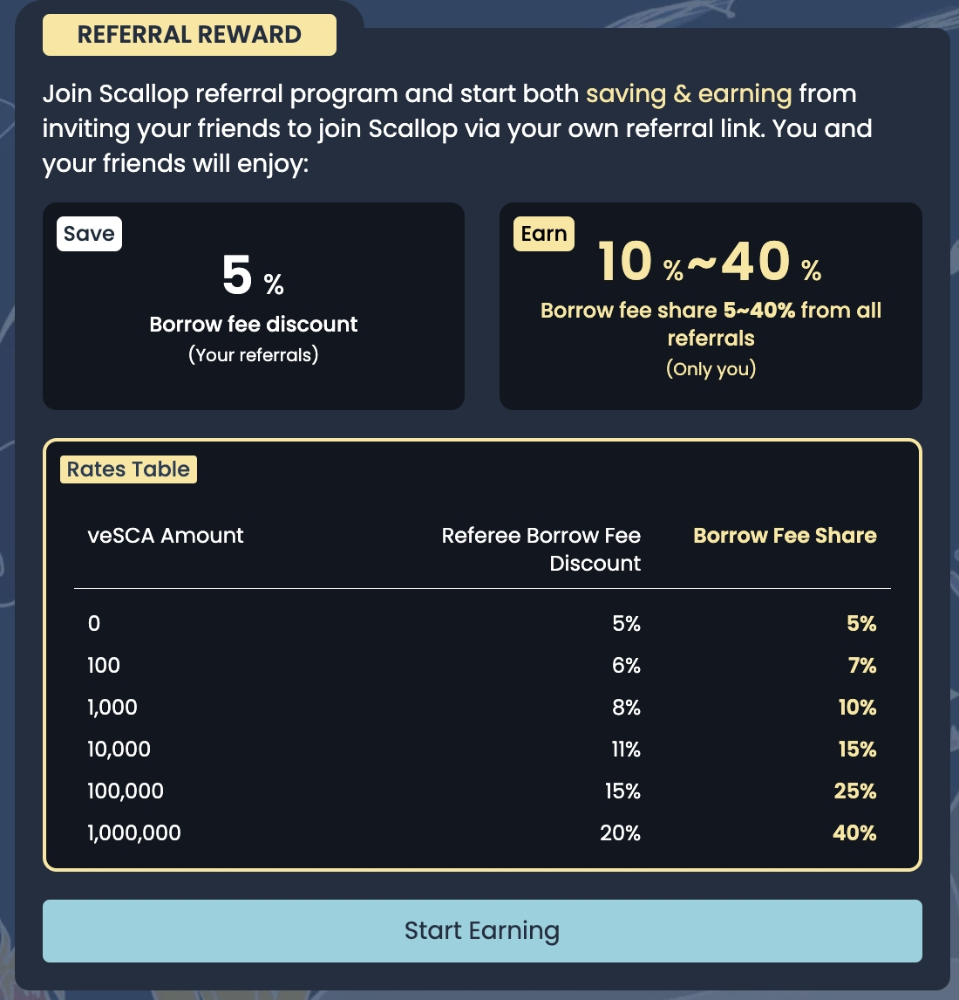
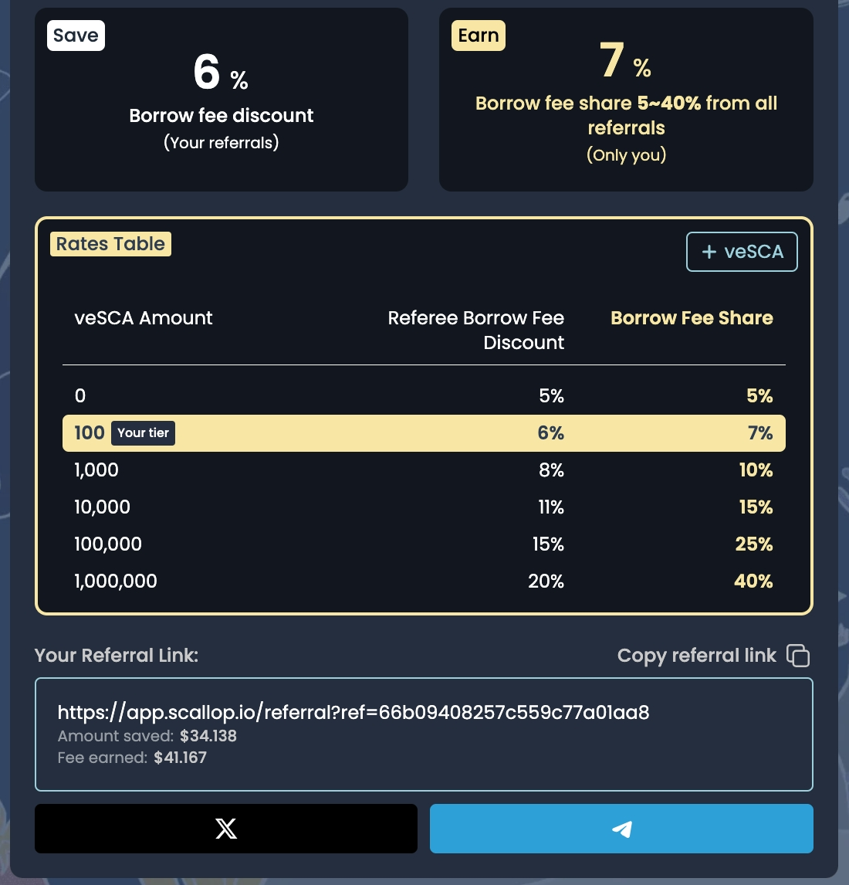
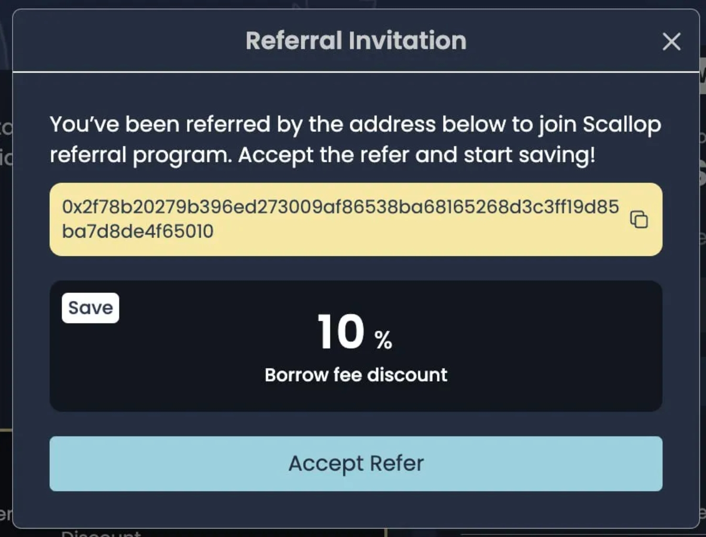

# Referral

Scallopers will be able to generate their unique referral link and share it to invite new users. When a new user joins Scallop through the referral link and create an obligation key on Scallop, this obligation key will be associated to the referrer through the referrer’s wallet address.

Do note that once you have accepted a referral link, you will not be able to unbind the referral link!

## Benefit of Referral Program

Referrer will get a share of the borrow fee generated each time their Referee borrows from Scallop pools. The share of borrow fee is dependent on the amount of veSCA held by the Referrer.

Referees will be eligible for up to 20% discount on their Borrow Fees when they borrow from Scallop.

**Tier-Based Rates**

<figure><figcaption></figcaption></figure>

Do note that these rates may be adjusted in the future.

## A Simple Example

Scallop A has **1000,000 veSCA**, and generates a referral link for Scalloper B.

Scalloper A is entitled to **40% Borrow Fee Share**.

Scalloper B who uses Scalloper A’s referral link will enjoy **20% Borrow Fee Discount**.

Let’s say Scalloper B borrows **$1,000**:

**The Base Borrowing Fee**: $1,000 \* 0.3% = $3

**Scalloper B needs to pay**: $3 \* (100% — 20%) = $2.4

**Borrowing Fee share for Referrer**: $3 \* 40% = $1.2

## Getting Started with Scallop Referral Program 

## How to Refer: 

**Step 1:** Head to Scallop Referral page under “Refer & Earn”

<figure><figcaption>
Referral Page: <a href="https://app.scallop.io/referral">https://app.scallop.io/referral</a>
</figcaption></figure>

**Step 2:** Click on “Start Earning” to generate your unique Referral Link.

You will be required to approve the transaction.

<figure><figcaption></figcaption></figure>

**Step 3:** Once the link is generated, you can now copy and share your link to start earning!

You will also be able to see your current eligible Borrow Fee Discount and Borrow Fee Share.

<figure><figcaption></figcaption></figure>

## How to Accept Referral: 

Visit a Referral Link and you will be prompted to accept the invitation. Simply click “Accept Refer” to join Scallop.

<figure><figcaption></figcaption></figure>

Once accepted, you can now see that your account will be binded to your Referrer’s code! Do note that you will not be able to unbind once you have accepted a referral code.

## Join the Scallop Referral Program Today 

By participating in the Scallop Referral Program, you’re not just earning rewards; you’re also helping grow our community. Stake your SCA and start sharing your referral link today!

\
