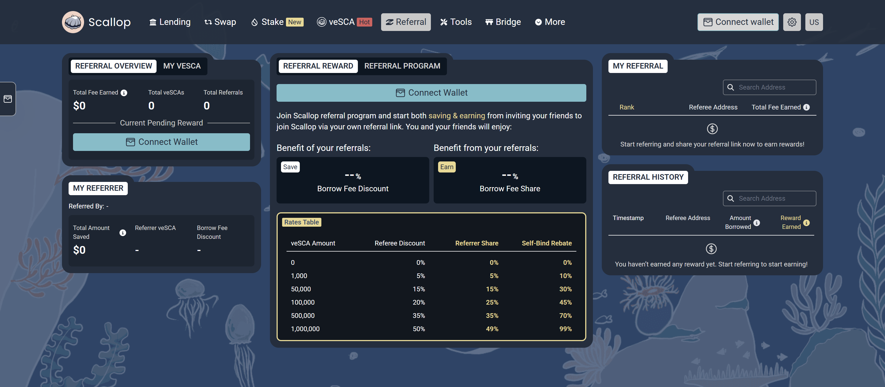

# Referral

The Scallop Referral Program pays you to bring borrowers to Scallop. Every Scalloper can create a referral link and share it. When someone binds to your link, both of you earn from every borrow that person makes.

Referral Program v2 is live. It rebalances the veSCA tiers, lets you unbind and rebind at any time, and lets you bind to your own link.

## What is new in v2

* **Rebalanced tiers.** More veSCA now gives a much larger discount and share.
* **Unbind and rebind.** You are no longer locked to one referrer. You can unbind at any time and accept a new link.
* **Self-referral.** You can bind to your own referral link. You then get the discount and the share together, as one Self-Bind Rebate.

***

## How it works

Your referral link belongs to a veSCA key, not to your wallet. If you hold several veSCA keys, each key has its own link.

The binding is between the referee's **wallet address** and the referrer's **veSCA key**. It covers every obligation account in that wallet. Version 1 bound the obligation key instead.

Every time the referee borrows, Scallop splits the borrow fee:

* The **referee** pays less. This is the Borrow Fee Discount.
* The **referrer** earns a cut of the fee. This is the Borrow Fee Share.

Both rates come from the referrer's tier. The tier follows the current veSCA balance of the bound key. veSCA decays over time, so a tier can fall. Lock more SCA, or lock for longer, to hold a tier.

### Tier-based rates

| veSCA Amount | Referee Discount | Referrer Share | Self-Bind Rebate |
| ------------ | ---------------- | -------------- | ---------------- |
| 0            | 0%               | 0%             | 0%               |
| 1,000        | 5%               | 5%             | 10%              |
| 50,000       | 15%              | 15%            | 30%              |
| 100,000      | 20%              | 25%            | 45%              |
| 500,000      | 35%              | 35%            | 70%              |
| 1,000,000    | 50%              | 49%            | 99%              |

A tier applies from its veSCA amount up to the next one. The Self-Bind Rebate is the discount plus the share. You get it only when you bind to your own link.

The rates table in the app reads these values from the chain. These rates can change in the future.

***

## Self-referral

Bind to your own referral link and you take both sides of the split. The app shows the total as the Self-Bind Rebate.

Self-referral is the best option if nobody else refers you and you hold veSCA. At 1,000,000 veSCA the rebate reaches 99% of your borrow fee.

***

## Examples

Scallop charges a 0.3% borrow fee on main assets. Emerging and isolated assets cost 1%. See [Fee](../protocol/fee.md).

### Example 1: refer a friend

Scalloper A holds **1,000,000 veSCA** and shares a referral link. Scalloper B binds to it.

Scalloper B borrows **$1,000** of a main asset:

* **Base borrow fee**: $1,000 × 0.3% = **$3**
* **Scalloper B pays**: $3 × (100% − 50%) = **$1.50**
* **Scalloper A earns**: $3 × 49% = **$1.47**

### Example 2: bind to your own link

Scalloper C holds **100,000 veSCA** and binds to their own link. The rebate is 20% + 25% = **45%**.

Scalloper C borrows **$1,000** of a main asset:

* **Base borrow fee**: $1,000 × 0.3% = **$3**
* **Scalloper C pays**: $3 × (100% − 20%) = **$2.40**
* **Scalloper C earns back**: $3 × 25% = **$0.75**
* **Net cost**: $2.40 − $0.75 = **$1.65**

***

## How to create your referral link

**Step 1:** Open the [Referral page](https://app.scallop.io/referral).

<figure><figcaption>
Referral page: <a href="https://app.scallop.io/referral">https://app.scallop.io/referral</a>
</figcaption></figure>

**Step 2:** Click **Start Earning**.

Your wallet asks you to sign a message. If you hold no veSCA key yet, the app first creates an empty one for you. That step is a transaction.

**Step 3:** Copy your link and share it.

Your link looks like `https://app.scallop.io/referral?ref=<code>`. The **Referral Reward** panel shows the discount your referees get and the share you earn. Use the X and Telegram buttons to post the link.

If you hold several veSCA keys, pick the key in the dropdown at the top of the panel. Each key has its own link and its own rewards.

## How to accept a referral

Open a referral link. The app shows the **Referral Invitation** dialog with the referrer address and your discount. Click **Accept Refer** and approve the transaction.

The **My Referrer** panel then shows who referred you, their veSCA, your discount, and the fees you saved.

## How to switch your referral

Open a new referral link while you are already bound. The app shows the **Switch Referral** dialog. It puts your current referral next to the new one, so you can compare the rates.

Click **Switch Referral** to change. One transaction unbinds the old referrer and binds the new one. The change takes effect at once, and you can switch again later.

## How to unbind

Open the **My Referrer** panel and click **Unbind**. Approve the transaction.

Your discount stops the moment you unbind. You keep what you already saved. You can accept a new link at any time, including your own.

## How to claim your rewards

The **Referral Overview** panel shows your total fee earned, your veSCA keys, your referral count, and your pending reward.

Click the claim button. Scallop collects the fees from every one of your veSCA keys, swaps them to SCA, supplies the SCA, and sends you **sSCA**. Your reward keeps earning lending yield from that point.

***

## Join the Scallop Referral Program today

Lock SCA, reach a higher tier, and share your link. Every borrow your referees make pays you back. And if you borrow yourself, bind to your own link and cut your own fee.
