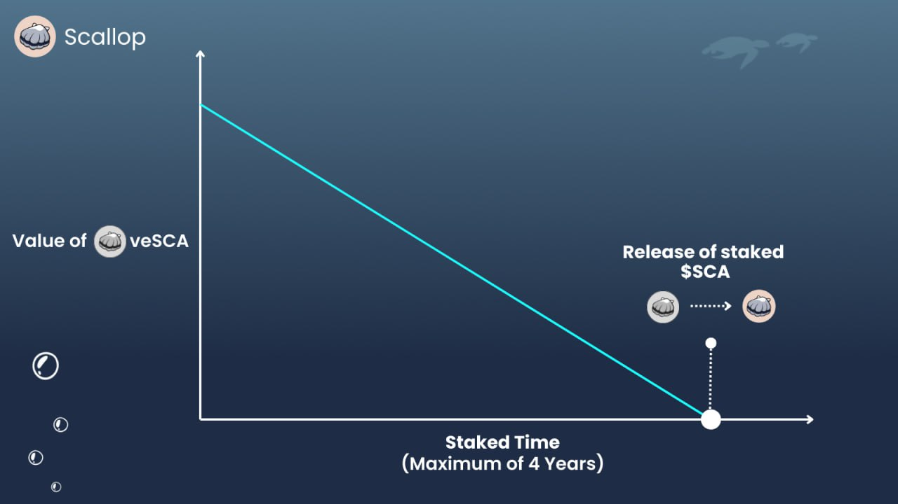

# veSCA

Scallop uses a special form of  $SCA tokens, called veSCA to enhance decentralization. This means that by holding veSCA, owners can enjoy more benefits, making the tokens more useful.

veSCA helps decrease the number of $SCA tokens available, which helps make the token more stable and strengthens the entire Scallop Platform.This approach is key to ensuring Scallop's success and longevity.

### Benefit of veSCA

1. Governance & Voting power
2. Booster of receiving token SCA Emission&#x20;
3. Receive fees from voted pools

***

### How to get veSCA

Simply lock your SCA and receive veSCA.

The amount of veSCA that you receive is proportional to the SCA and duration locked. Your veSCA amount will decay over time. It will reach zero once the lock duration is over. Your locked SCA will then be fully released.\

<figure><figcaption>
veSCA decay chart
</figcaption></figure>

You can increase your veSCA value by choosing to extend your staking duration and/or increase your staked amount.

<figure><figcaption></figcaption></figure>

The longer you lock the more veSCA you get in return.

#### veSCA Formula

$$
veSCA = SCA \times (RemainLockPeriod  \div4 Years)
$$

#### **Locking Principal**

* The unlock date only occurs everyday at 12 AM UTC. Therefore, users need to select this unlock date.
* One round lasts for one day (24 hours).
* Users need to lock **at least one full round**. So for example, if they start at 12 PM UTC, they can’t unlock it on the next 12 AM UTC (12 hours later) because it’s **not a full round yet**. In this case, users need to lock it for more than one day to achieve at least one full round.
* The minimum round is 1 and the maximum round is 1460. Maximum round is equal to 4 years.

#### **Lock more SCA**

* If users increase their SCA stake without changing the lock-up period, it will also refresh the amount of their veSCA.

**Extending Period**

* Users can opt for a longer lock-up period. The value of the users’ veSCA will be recalculated. It is not possible to shorten the lock-up period.

#### Redeem veSCA

* Users can take back 100% of SCA after the lock is over.

***

## veSCA utility

### Boost Earning by holding veSCA. 

* Users can boost their earnings by holding veSCA. veSCA needs to be held when they deposit funds into a pool that offers incentives. For example, if a pool offers a 20% APR for depositing liquidity, holding a certain amount of veSCA can provide a boost, say up to 5x. Initially, the APR is 20%, which then becomes 100% after a 5x boost.
* The amount of boost a user receives depends on the percentage share of veSCA they hold. The more liquidity a user has, the more veSCA they need.


If your **Boost Value** is incorrect, it means it hasn't been refreshed. It will update after you take actions like borrowing, supplying, repaying, staking SCA, or extending the lock period. Alternatively, you can manually refresh your boost by visiting the staking page and clicking the '**Refresh Boost**' button.


_Formula to calculate earning weight._

<figure><figcaption>
Formula to calculate earning weight
</figcaption></figure>

\
&#xNAN;_&#x46;ormula to calculate earning boost. The percentage of earnings you receive. The minimum is 100%, representing the base earning._

<figure><figcaption></figcaption></figure>

Now, calculating the APR you will receive is

\

$$
EarningAPR = PoolIncentiveAPR \times EarningBoost
$$

Let’s simulate different scenarios to prove that _veSCA amount_ and _coinAmount_ are correlated. Assuming veSCA total supply is **500,000**.

<figure><figcaption></figcaption></figure>

Table above illustrates that when _User Supply Amount_ increases, _veSCA amount_ needs to be increased — to maintain the _Earning APR_, otherwise the _APR_ will decrease.

### Loyalty Program (Q2 2024)  

The Loyalty Program is designed to reward users when we reach certain revenue milestones. At each milestone, we will conduct a buyback of our tokens, and these tokens will be distributed to users who hold veSCA.\

### Governance (Q3 2024) 

&#x20;   Scallop’s Governance, also known as veSCA, will help enable a higher degree of decentralization.

