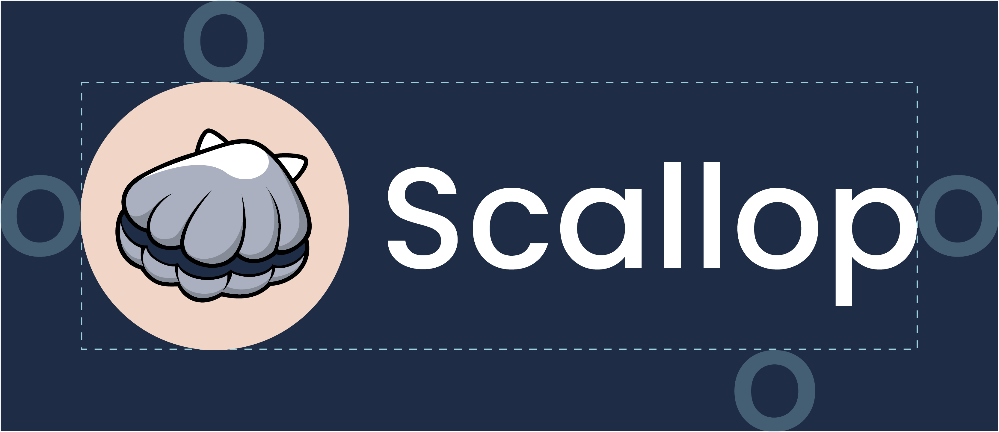
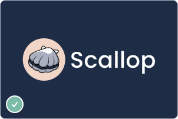
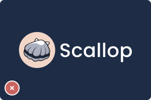
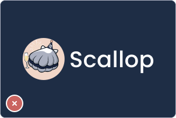
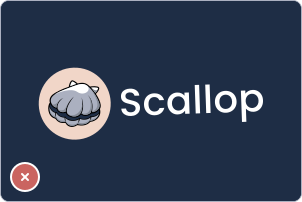

# Brand kit 🎨

<a href="https://drive.google.com/drive/folders/1WTuq2xecB_ZIQIHpeURbZsG2AOXjX3ZC?usp=sharing" class="button primary" data-icon="download">Download Brand Kit</a>

***

## Logo

### Logo Configurations

The Scallop logo has an iconic scallop illustration, symbolizing the brand name and aligning with the theme of Sui Blockchain.

Present Scallop’s logo in these four ways. Apply Scallop logo with the suitable [Color Configuration](brand-kit.md#logo-configurations) so that the logo maintain its visibility and legibility.


* Scallop also uses logos specially crafted for special occasions. For example, New Year, Christmas, CNY, and special campaigns logo. We use this in Scallop DApp and social medias.\
  Always use the original logo in this brand kit (not seasonal ones) for partnership purposes.
* In written text, write Scallop with a capital S; ‘Scallop’.


<table data-card-size="large" data-view="cards"><thead><tr><th></th><th></th><th></th><th data-hidden data-card-cover data-type="files"></th></tr></thead><tbody><tr><td><strong>Logotype</strong></td><td>Always use this logo whenever possible as this is the most recognizable visual shorthand of Scallop’s brand.</td><td><a href="https://drive.google.com/drive/folders/1xcqCdXQeeCeML-27yiHjdBNd8tCrMesh">Download</a></td><td><a href="../.gitbook/assets/logotype_primary_color_preview.svg">logotype_primary_color_preview.svg</a></td></tr><tr><td><strong>Vertical Logotype</strong></td><td>Use the vertical lockup when the space is limited or constrained. </td><td><a href="https://drive.google.com/drive/folders/1KRe4XNuZDG6_5kRYmojFOi_TqPGl-ku7">Download</a></td><td><a href="../.gitbook/assets/vertical_primary_color_preview.svg">vertical_primary_color_preview.svg</a></td></tr><tr><td><strong>Logomark</strong></td><td>Use the logomark icon as a shorthand to the full Logotype logo.</td><td><a href="https://drive.google.com/drive/folders/1vEDr-K8Cm1Hc7NYq9_D62ecfKV_mf8S1">Download</a></td><td><a href="../.gitbook/assets/logomark_primary_color_preview.svg">logomark_primary_color_preview.svg</a></td></tr><tr><td><strong>Wordmark</strong></td><td>Use the wordmark in special cases where the other logo configurations are not suitable.</td><td><a href="https://drive.google.com/drive/folders/1aqxUqGiTsxJo2XCb6VFH1tcd7msimDel">Download</a></td><td><a href="../.gitbook/assets/wordmark_light_grayscale_preview.svg">wordmark_light_grayscale_preview.svg</a></td></tr></tbody></table>

### Logo Color Configurations

Always choose the color of Scallop logo based on these color configurations. Maintain the consistency of Scallop brand while keeping the logo legible.

<table data-card-size="large" data-view="cards"><thead><tr><th></th><th></th><th data-hidden data-card-cover data-type="files"></th></tr></thead><tbody><tr><td><strong>Primary Color Configuration</strong></td><td>Scallop logo’s primary configuration is the Scallop logotype with white font color. Make sure to apply this configuration whenever possible.</td><td><a href="../.gitbook/assets/logotype_primary_color_preview.svg">logotype_primary_color_preview.svg</a></td></tr><tr><td><strong>Reversed Primary Color Configuration</strong></td><td>Scallop logo’s reversed primary configuration is the Scallop logotype with black font color. Apply this configuration on light background, when the primary color logo is not suitable.</td><td><a href="../.gitbook/assets/logotype_reversed_primary_color_preview.svg">logotype_reversed_primary_color_preview.svg</a></td></tr><tr><td><strong>Light Grayscale Configuration</strong></td><td>Apply this configuration only on special occasions, such as only one color ink is available. Apply on dark colored background. </td><td><a href="../.gitbook/assets/logotype_light_grayscale_preview.svg">logotype_light_grayscale_preview.svg</a></td></tr><tr><td><strong>Dark Grayscale Color Configuration</strong></td><td>Apply this configuration only on special occasions, such as only one color ink is available. Apply on light colored background.</td><td><a href="../.gitbook/assets/logotype_dark_grayscale_preview.svg">logotype_dark_grayscale_preview.svg</a></td></tr></tbody></table>

### Logo Clearspace

Scallop logo needs a minimum amount of spacing to maintain the visibility, legibility, and visual impact.

To make sure the logo has enough clear space, use the letter ‘o’ in the wordmark as a guide for spacing. Do not place any objects, such as graphics or text in the clear space shown.

<figure><figcaption></figcaption></figure>

### Logo Placement Guide



<figure><figcaption>
Always use the official logo in the approved configurations and correct brand
 colors
</figcaption></figure>

<figure><figcaption>
Don’t stretch the logo in non-uniform way
</figcaption></figure>

<figure><figcaption>
Don’t apply the logo in low resolution
</figcaption></figure>



<figure><figcaption>
Don’t use Scallop seasonal logo for partnership/formal purposes
</figcaption></figure>

<figure><figcaption>
Don’t add any effect to the logo
</figcaption></figure>

<figure><figcaption>
Don’t rotate the logo
</figcaption></figure>



### Sub-brands

Scallop products and services that are not uniquely branded use this generic layout to keep the brand consistency.&#x20;

The logos are constructed from the Scallop logotype and sub-brand wordmark. We put a greater emphasis on the core branding by differentiating the size and wordmark weight. View the samples below.

[Download Sub-brands Logo](https://drive.google.com/drive/folders/1eBv08FwyE1suzfxFAx38M0fQpghKEbNb?usp=drive_link)

<figure><picture><source srcset="../.gitbook/assets/scallop_lend_primary_color.svg" media="(prefers-color-scheme: dark)"></picture><figcaption></figcaption></figure>

***

<figure><picture><source srcset="../.gitbook/assets/scallop_swap_primary_color.svg" media="(prefers-color-scheme: dark)"></picture><figcaption></figcaption></figure>

***

<figure><picture><source srcset="../.gitbook/assets/scallop_tools_primary_color.svg" media="(prefers-color-scheme: dark)"></picture><figcaption></figcaption></figure>

## Colors

### Brand Colors

These are Scallop’s brand color palette that reflects the brand personality.&#x20;

The palette consists of shades of blue and coral, inspired by scuba-diving seascape. These colors, reflecting our product, connecting to the sea themes and fostering professionalism and nature growth.

<table data-card-size="large" data-view="cards"><thead><tr><th></th><th></th><th></th><th data-hidden data-card-cover data-type="files"></th></tr></thead><tbody><tr><td><strong>Ocean</strong></td><td>Scallop's Navy Color HEX: #1E2D45 RGB: 30/45/69 CMYK: 54/38/0/73 PMS: 533C</td><td>Use this color prominently for backgrounds, graphic elements, establishing the overall brand mood.</td><td><a href="../.gitbook/assets/color-container-ocean.svg">color-container-ocean.svg</a></td></tr><tr><td><strong>Bubble</strong>
</td><td>Scallop's Light Blue Color HEX: #9CD0DD
 RGB: 156/208/221
 CMYK: 29/6/0/13</td><td>Use this color for CTA, interactive elements, and to provide visual contrast. Use sparingly to maintain its impact.</td><td><a href="../.gitbook/assets/color-container-bubble.svg">color-container-bubble.svg</a></td></tr><tr><td><strong>Sand</strong></td><td>Scallop's Peach Color HEX: #F1D6C8 RGB: 241/214/200 CMYK: 0/11/17/5</td><td>Sand is the circle color of our logo. Use this color as a subtle accent on texts or graphic elements to tie back to the brand's visual identity.</td><td><a href="../.gitbook/assets/color-container-sand.svg">color-container-sand.svg</a></td></tr><tr><td><strong>Twilight</strong></td><td>Scallop's Grey-Blue Color HEX: #334664
 RGB: 51/70/100 CMYK: 49/30/0/61</td><td>Use this color for section backgrounds, an alternative (secondary blue) to Ocean.</td><td><a href="../.gitbook/assets/color-container-twilight.svg">color-container-twilight.svg</a></td></tr><tr><td><strong>Mist</strong></td><td>Scallop's Grey Color HEX: #F1D6C8 RGB: 241/214/200 CMYK: 0/11/17/5</td><td>Mist is the prominent color of our logo. Use this color as neutral supporting color.</td><td><a href="../.gitbook/assets/color-container-mist.svg">color-container-mist.svg</a></td></tr><tr><td><strong>Night</strong></td><td>Scallop's Black Color HEX: #000000 RGB: 0/0/0 CMYK: 100/100/100/100</td><td>Night is our text color on light background. Use this color as neutral supporting color.</td><td><a href="../.gitbook/assets/color-container-night.svg">color-container-night.svg</a></td></tr><tr><td><strong>Pearl</strong></td><td>Scallop's White Color HEX: #FFFFFF RGB: 255/255/255 CMYK: 0/0/0/0</td><td>Pearl is our main longform texts color. Use this color as neutral supporting color.</td><td><a href="../.gitbook/assets/color-container-pearl.svg">color-container-pearl.svg</a></td></tr></tbody></table>

### Functional Colors

These are the colors that we use to convey status or meanings in app interface and medias.

<table data-view="cards"><thead><tr><th></th><th></th><th data-hidden data-card-cover data-type="files"></th></tr></thead><tbody><tr><td><strong>Green</strong></td><td>HEX: #7BBBA7 RGB: 123/187/167 CMYK: 34/0/11/27</td><td><a href="../.gitbook/assets/color-container-green.svg">color-container-green.svg</a></td></tr><tr><td><strong>Red</strong></td><td>HEX: #CA6460 RGB: 202/100/96 CMYK: 0/50/52/21</td><td><a href="../.gitbook/assets/color-container-red.svg">color-container-red.svg</a></td></tr><tr><td><strong>Yellow</strong></td><td>HEX: #E8D997 RGB: 232/217/151 CMYK: 0/6/35/9</td><td><a href="../.gitbook/assets/color-container-yellow.svg">color-container-yellow.svg</a></td></tr></tbody></table>

## Typography

Scallop uses Poppins and Roboto for our brand communications and application interface.

<table data-card-size="large" data-view="cards"><thead><tr><th></th><th></th><th></th><th data-hidden data-card-target data-type="content-ref"></th><th data-hidden data-card-cover data-type="files"></th></tr></thead><tbody><tr><td><strong>Poppins</strong></td><td>
Used in headlines and titles.
<ul><li>In app interface, we use Poppins SemiBold.</li><li>In marketing outputs, we use Poppins Extrabold. We also use Poppins Bold in case where ExtraBold are not suitable for titles.</li></ul></td><td><a href="https://fonts.google.com/specimen/Poppins">Download</a></td><td><a href="https://fonts.google.com/specimen/Poppins">https://fonts.google.com/specimen/Poppins</a></td><td><a href="../.gitbook/assets/headline.svg">headline.svg</a></td></tr><tr><td><strong>Roboto</strong></td><td>
Used in body texts.
<ul><li>In app interface and marketing, we use Roboto Regular for body texts.</li><li>In app interface and marketing, we use Roboto SemiBold for body text highlight.</li></ul></td><td><a href="https://fonts.google.com/specimen/Roboto">Download</a></td><td><a href="https://fonts.google.com/specimen/Roboto">https://fonts.google.com/specimen/Roboto</a></td><td><a href="../.gitbook/assets/body.svg">body.svg</a></td></tr></tbody></table>

