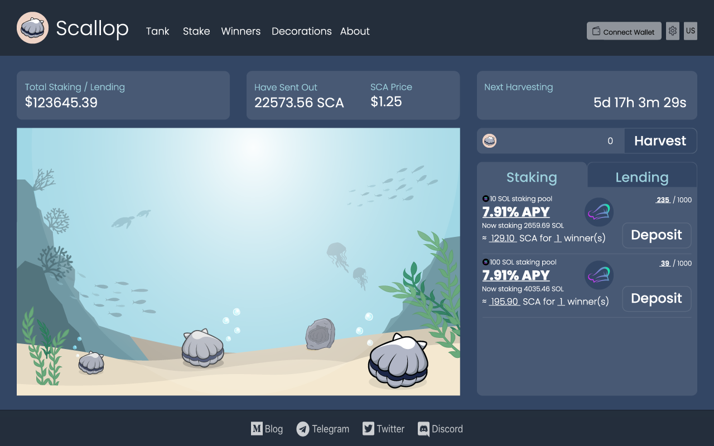

# Rules 👩‍🏫

### Rules📋**：**

Users can stake tokens and get scallops to grow at Scallop tank , after staking over 7 days, users will have the qualification of harvesting.   
  
**Every Friday 20:00 \(GMT+8\) will be the harvest time.** 


After harvesting, one \(or a few\) of winners chosen by program randomly will get Scallop token \(SCA\) with the same value of staking reward, 7% of staking reward will be kept in the staking pool and 93% will be SCA buyback.


There will be different tiers and address limits and different SPL token of pools to let users to stake tokens, ex:

* 100 SCA/1000 address
* 100 RAY/1000 address
* 10 SOL/1000 address
* 100 SOL/100 address
* 100 USDC/∞ address

You can see where the funds will go on the front-end, our program will use the fund of pools to earn rewards by:

* Stake SOL on Solana Validator.
* 
  Stake SPL tokens.

* 
  Lend to some lending projects.

* 
  Join some liquidity mining pool.

#### Notice🔎**：**

* If users keep staking, they can harvest every week.
* We are going to invoke Switchboard VRF on Solana and it will help our program to choose one \(or a few\) winner of each week. 

### **Tasks**🏅**：**

We don’t want users to join us for months and get nothing so during the game: users can carry out some tasks like:

* Join 10 SOL pools over a month.
* 
  Stake more than 10K SCA over two weeks.

* 
  Offer $100 values to SCA/USDC Liquidity pools over a month.

To win:

* Scallop Decorations
* Extra SPL tokens
* SCA
* NFTs

Extra SPL token rewards will be the token minted by partnership projects, we will use SCA or Scallop Decorations to trade their tokens or NFTs.

  

