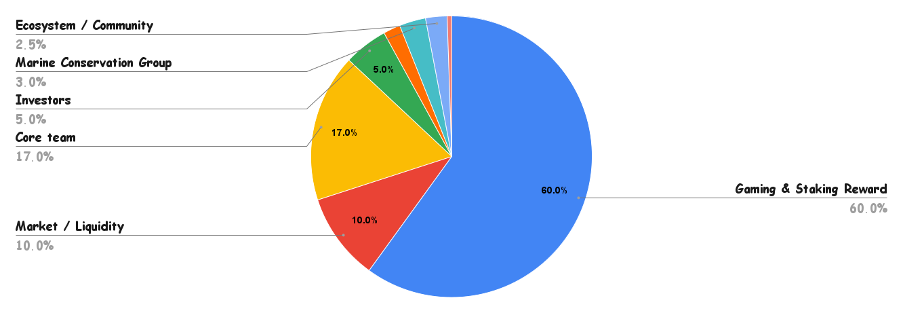

# Tokenomic

## **Scallop Coin \(SCA\)** Token model**：**

| Max Supply **1,000,000,000 SCA** | **100%** | **1,000,000,000** |
| :--- | :--- | :--- |
| **Gaming & Staking Reward** | **60%** | **600,000,000** |
| **Market / Liquidity** | **10%** | **100,000,000** |
| **Core team**  | **17%** | **170,000,000** |
| **Investors** | **5%** | **50,000,000** |
| **Adviser / Helper** | **2%** | **20,000,000** |
| **Marine Conservation Group** | **3%** | **30,000,000** |
| **Ecosystem / Community** | **2.5%** | **25,000,000** |
| **Airdrop** | **0.5%** | **5,000,00** |

#### The basic SCA tokenomics are**：**

* Max Supply ****1,000,000,000 SCA.
* The total SCA mining reserve consists of 60%.
* 75% of Market/Liquidity unlocked at beginning, 5% will unlock at each quarter.
* All team tokens are vested on-chain with a cliff of 6 months and 3 year linear vesting.
* 93% of scallop pool's SOL staking reward will buy back SCA and burn which means SCA is a Deflationary Token.

#### 

#### 

