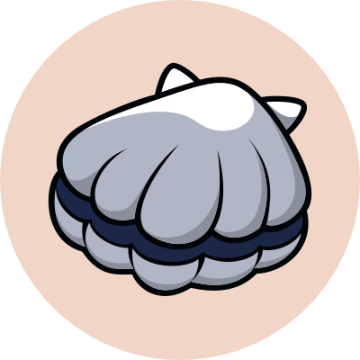

# Tokenomic

## **Scallop **Token **(SCA) **Model**：**

| **Allocation**                        | **Percentage** | **Number of Tokens ** |
| ------------------------------------- | -------------: | --------------------: |
| **Gaming Reward**                     |     **27.50%** |        **66,000,000** |
| **Staking Reward**                    |     **27.50%** |        **66,000,000** |
| **Core Team**                         |     **18.00%** |        **43,200,000** |
| **Investor**                          |     **10.00%** |        **24,000,000** |
| **Ecosystem / Community / Marketing** |      **8.50%** |        **20,400,000** |
| **Liquidity**                         |      **4.00%** |         **9,600,000** |
| **Advisor**                           |      **2.00%** |         **4,800,000** |
| **Piblic Sale**                       |      **2.00%** |         **4,800,000** |
| **Airdrop**                           |      **0.50%** |         **1,200,000** |
| **Total**                             |    **100.00%** |       **240,000,000** |

####

#### The basic SCA token model is**：**

* SCA is a **deflationary token.**
* Initial Circulating Supply 10,569,761 SCA.
* Max Supply** 240000000 SCA**.
* The total user reserve consists of 60%.
* Team tokens are locked on-chain with a cliff of 1\~2 years and 1\~3 years linear unlocking.

####
