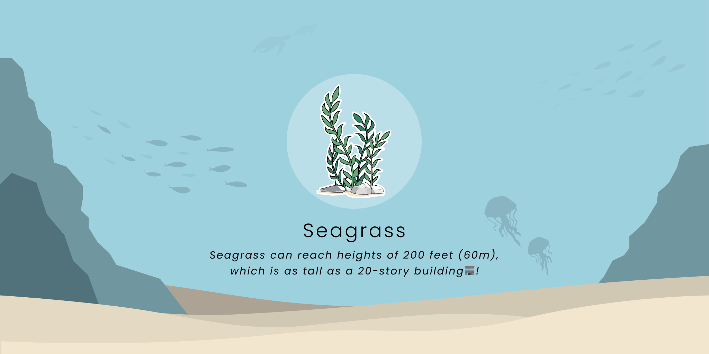
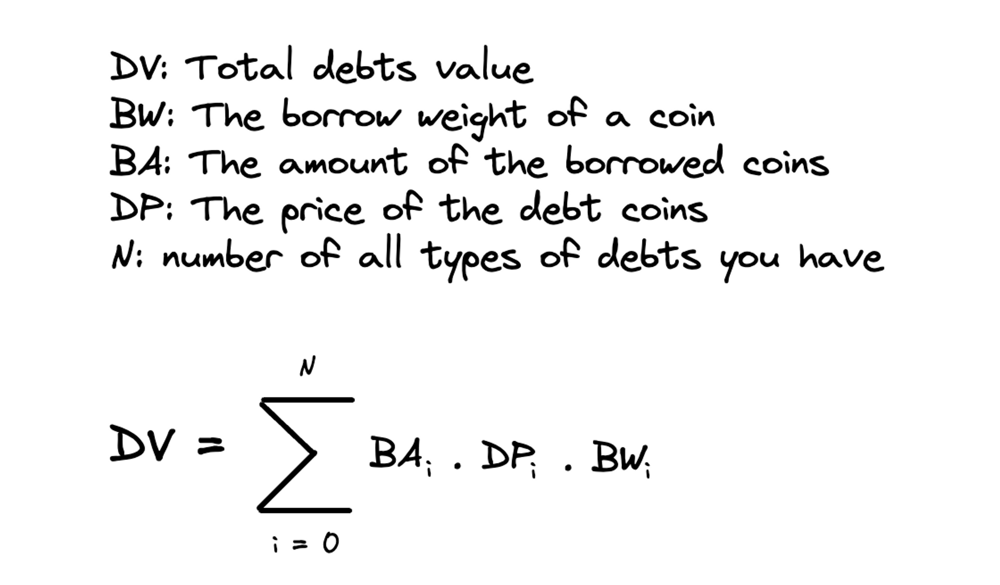
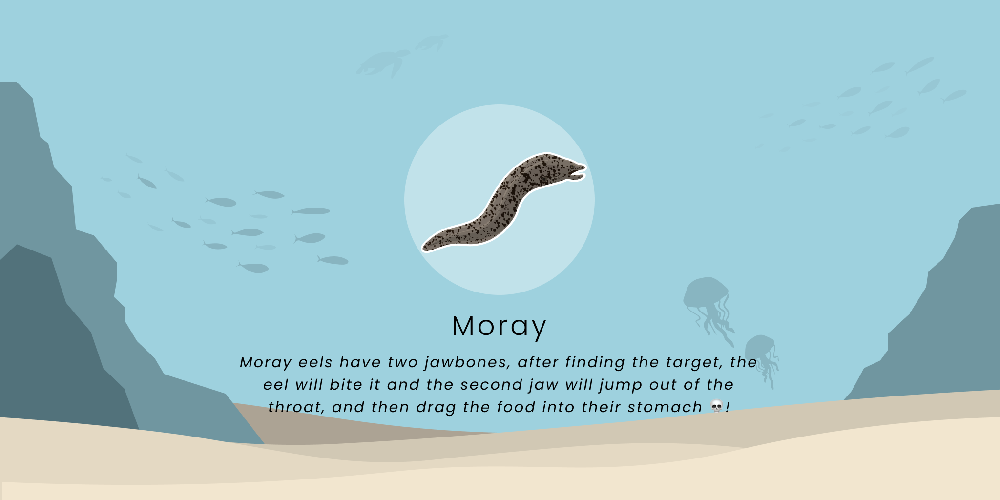

# Decorations✨

### Seagrass Decorations🌱:

Seagrass can reach heights of 200 feet (60m), which is as tall as a 20-story building🏢.

Address: SeawdHf3NHG6gxCrezQxr5oJAHTLJd6JsQxxd144yaz\
Serum Market id: HY8f1hFK1EvhDymSNhtogVxHy5oMyxy5d5CGwpuYuV5S\
Symbol: Seagrass\
Name: Scallop Seagrass Decorations\
Decimals: 0\
Max Supply: 10000 (Tentative)\
Rarity: ★✰✰✰✰

### Urchin Decorations

<figure><figcaption></figcaption></figure>

Urchin lives on the seabed of every ocean and inhabits every depth zone, the closest echinoderm relatives are the sea cucumbers. Urchin is popular in aquariums, where they are useful for controlling algae. Fossil urchins have been used as protective amulets.

Address: uchinWHVk4SWcGbhyXiurqAAFXTdC7cRvxNofYMPsy3\
****Symbol: Urchin\
Name: Scallop Urchin Decorations \
Decimals: 0 \
Current Supply: ? \
Rarity: ★★✰✰✰

### **Moray Decorations** 🐍

Moray eels have two jawbones, after finding the target, the eel will bite it and the second jaw will jump out of the throat, and then drag the food into their stomach 💀!&#x20;

Address: MoraycScyx4PNYbecRjnw3qXiC6syZkQRH9PoWUoioL \
****Symbol: Moray \
Name: Scallop Moray Decorations \
Decimals: 0 \
Current Supply: ? \
Rarity: ★★★✰✰

### Nautilus **Decorations**

<figure><figcaption></figcaption></figure>

Nautilus survive for hundreds of millions of years and is one of the most well-known living fossils. The first submarine is also named Nautilus because the structure of the nautilus inspired human submarine design.

Address: nUtLSXpe1pqyYjKx9t8R1iJYDqFPuee8nRUcVqXNimR\
****Symbol: Nautilus\
Name: Scallop Nautilus Decorations \
Decimals: 0 \
Current Supply: ? \
Rarity: ★★★★✰

### &#x20;Fossil **Decorations** 🗿:

.png>)

There were archaeologists found Scallop fossils on Mount Everest🏔!

Address: FossiLkXJZ1rePN8jWBqHDZZ3F7ET8p1dRGhYKHbQcZR\
Serum Market ID: NF5PoXovc9wpWMPMrGeCQSmJRAEEUFCR3UZGVHTonf9\
Symbol: Fossil\
Name: Scallop Fossil Decorations\
Decimals: 0\
Max Supply: 400 (Fixed)\
Rarity: ★★★★★

### ****
