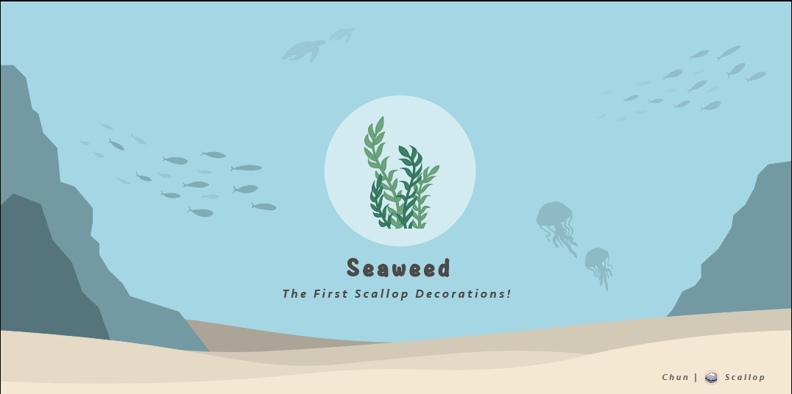

# Scallop's

####  Seaweed :

Seaweed is the first Scallop Decorations and the most common Scallop Decorations in every Scallop tanks!

Address : SeawdHf3NHG6gxCrezQxr5oJAHTLJd6JsQxxd144yaz  
Symbol : Seaweed  
Name : Scallop Seaweed Decorations  
Decimals : 0  
Supply : 338 \(Unlimited\)  
Rarity : ★✰✰✰✰

#### 

#### Scallop Fossil 🪨:

???

Address : ???  
Symbol : Fossil  
Name : Scallop Fossil Decorations  
Decimals : 0  
Supply : ??? \(Limited\)  
Rarity : ★★★★★

