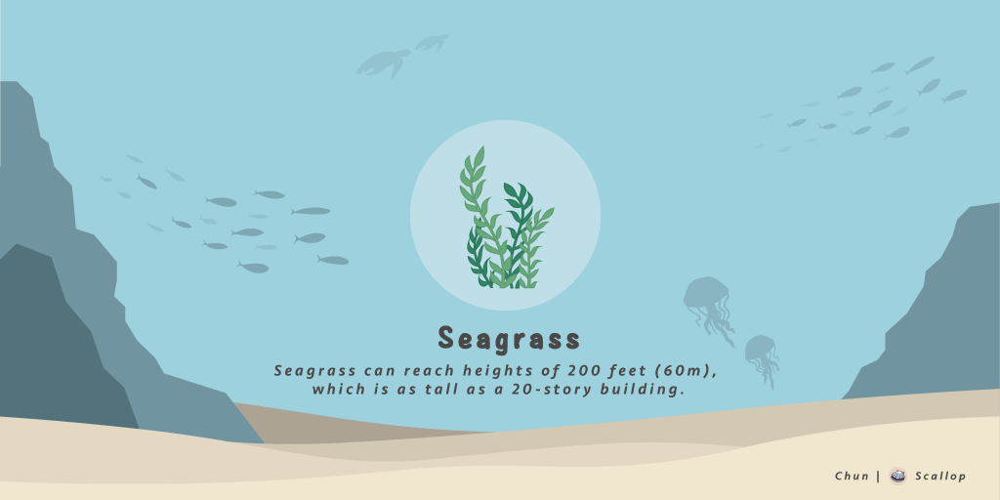

# Illustrated Book

#### Seagrass 🌱:

Seagrass can reach heights of 200 feet \(60m\), which is as tall as a 20-story building🏢.

Address : SeawdHf3NHG6gxCrezQxr5oJAHTLJd6JsQxxd144yaz  
Symbol : Seagrass  
Name : Scallop Seagrass Decorations  
Decimals : 0  
Max Supply : 10000 \(Tentative\)  
Rarity : ★✰✰✰✰

#### 

#### Scallop Fossil 🗿:

There were archaeologists found Scallop fossils on Mount Everest🏔!

Address : FossiLkXJZ1rePN8jWBqHDZZ3F7ET8p1dRGhYKHbQcZR  
Serum Market ID : NF5PoXovc9wpWMPMrGeCQSmJRAEEUFCR3UZGVHTonf9  
Symbol : Fossil  
Name : Scallop Fossil Decorations  
Decimals : 0  
Max Supply : 400 \(Fixed\)  
Rarity : ★★★★★

