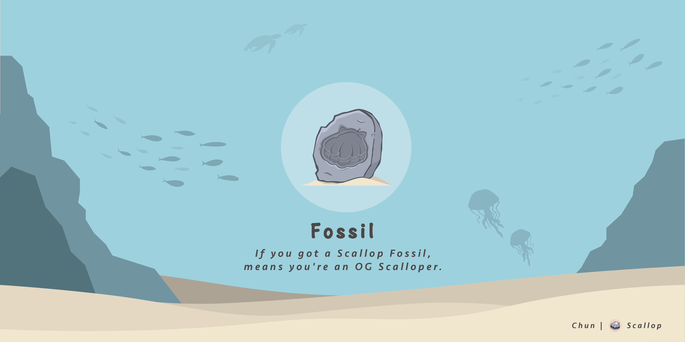

# Ours

####  Seaweed :

Seaweed is the first Scallop Decorations and the most common Scallop Decorations in every Scallop Tanks!

Address : SeawdHf3NHG6gxCrezQxr5oJAHTLJd6JsQxxd144yaz  
Symbol : Seaweed  
Name : Scallop Seaweed Decorations  
Decimals : 0  
Supply : 338 \(Unlimited\)  
Rarity : ★✰✰✰✰

#### 

#### Scallop Fossil 🗿:

The first limited Scallop Decorations. Users who have a Scallop Fossil means they are an OG Scalloper and are our early supporters.

Address : FossiLkXJZ1rePN8jWBqHDZZ3F7ET8p1dRGhYKHbQcZR  
Market id : NF5PoXovc9wpWMPMrGeCQSmJRAEEUFCR3UZGVHTonf9  
Symbol : Fossil  
Name : Scallop Fossil Decorations  
Decimals : 0  
Supply : 400 \(Limited\)  
Rarity : ★★★★★

