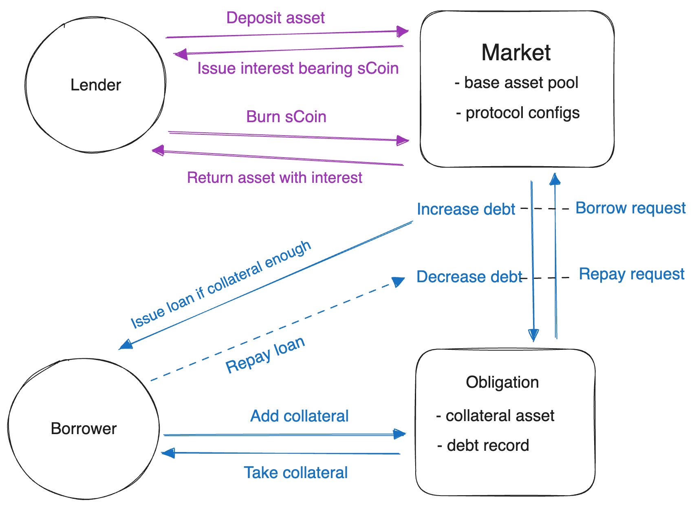

# Core Scallop Contract - Protocol
Protocol contract contains all the business logic related to the lending/borrowing.

### Contract design

A high level graphic representation of contract design

**Description:**

Lender interacts with `Market` through `sCoin`. Lender gets sCoin as proof of deposited asset. When lender need asset back, just passes sCoin to Market. Market will return corresponding amount of asset with generated interest.

Borrower interacts with `Market` through `Obligation`. Borrower adds collateral to obligation, and requests loan from Market with the obligation. Market issues the loan if collateral is enough, and increase the debt record in the obligation.
When borrowers repay the loan, the debt record in obligation will be decreased. Borrowers can also take back collaterals if the obligation risk level is below 1.

## Contract Source & Deployment

https://github.com/scallop-io/sui-lending-protocol/tree/main/contracts/protocol

**Initial package**: 0xefe8b36d5b2e43728cc323298626b83177803521d195cfb11e15b910e892fddf

**Latest package**: 0x38fe42a5a69f7eb3635404389e8003be9457b1a5c873f133184648c7e9bd47b7

