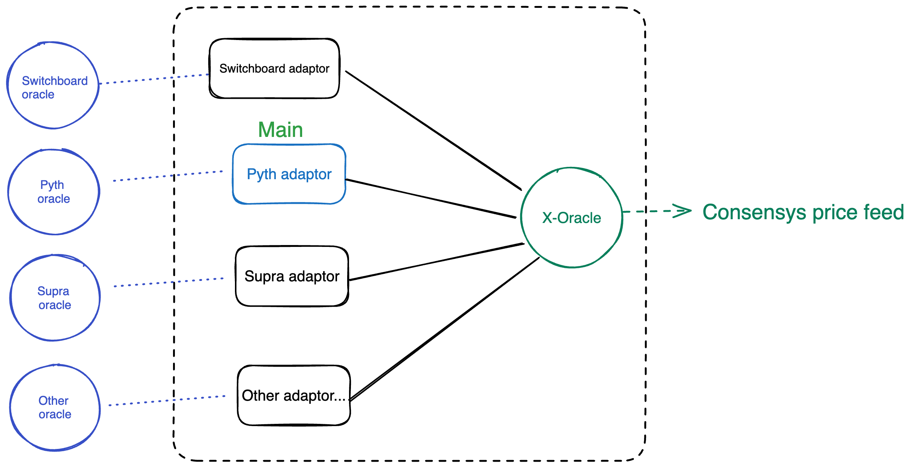

# Core Scallop Contract - X-oracle
X-oracle aggregates price feeds from multiple oracle providers, and output a price feed if the consensys is meet among these oracle providers.
Adapter pattern is adpoted to allow different oracles to work together.

## Contract Source & Deployment

### X-oracle

https://github.com/scallop-io/sui-lending-protocol/tree/main/contracts/sui_x_oracle/x_oracle

**Initial package**: 0x1478a432123e4b3d61878b629f2c692969fdb375644f1251cd278a4b1e7d7cd6

**Latest package**: 0x1478a432123e4b3d61878b629f2c692969fdb375644f1251cd278a4b1e7d7cd6

### Pyth adaptor

https://github.com/scallop-io/sui-lending-protocol/tree/main/contracts/sui_x_oracle/pyth_rule

**Initial package**: 0x910f30cbc7f601f75a5141a01265cd47c62d468707c5e1aecb32a18f448cb25a

**Latest package**: 0x910f30cbc7f601f75a5141a01265cd47c62d468707c5e1aecb32a18f448cb25a

(Notice: Supra adaptor, Switchboard adpator is not deployed in production yet due to price feed incomplete yet)

### Contract design

high level graphic representation of contract design

