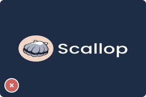

# 品牌工具 🎨

<a href="https://drive.google.com/drive/folders/1WTuq2xecB_ZIQIHpeURbZsG2AOXjX3ZC?usp=sharing" class="button primary" data-icon="download">下載品牌工具包</a>

***

## 品牌標誌 (Logo)

### 標誌組合形式（Logo Configurations）

Scallop 的標誌是一個扇貝圖案，除了代表品牌名稱，也呼應了 Sui 區塊鏈的海洋主題。

請以這四種標誌組合形式呈現 Scallop 標誌，並搭配適合的[配色規範](brand-kit.md#biao-zhi-pei-se-gui-fan-logo-color-configurations)使用，以確保標誌在各種情境下都具備良好辨識度與可讀性。


*   遇到特殊節日或活動時，例如新年、聖誕節、農曆新年或各種行銷活動，我們也會推出特別版的標誌。這些設計會用在 Scallop 的 DApp 和社群媒體上。

    不過，如果是跟其他單位合作，請務必使用這份品牌手冊裡提供的標準版標誌，不要使用節慶版。
* 在文字中提到品牌名稱時，請將首字母大寫，寫成：「Scallop」 。


<table data-card-size="large" data-view="cards"><thead><tr><th></th><th></th><th></th><th data-hidden data-card-cover data-type="files"></th></tr></thead><tbody><tr><td>標準標誌 (Logotype)</td><td>請盡可能使用此版本，這是 Scallop 最具代表性的標誌形式。</td><td><a href="https://drive.google.com/drive/folders/1xcqCdXQeeCeML-27yiHjdBNd8tCrMesh">下載</a></td><td><a href="../.gitbook/assets/logotype_primary_color_preview.svg">logotype_primary_color_preview.svg</a></td></tr><tr><td>垂直標誌 (Vertical Logotype)</td><td>當橫向空間不足時，建議使用此垂直排列的版本。</td><td><a href="https://drive.google.com/drive/folders/1KRe4XNuZDG6_5kRYmojFOi_TqPGl-ku7">下載</a></td><td><a href="../.gitbook/assets/vertical_primary_color_preview.svg">vertical_primary_color_preview.svg</a></td></tr><tr><td>圖形標誌 (Logomark)</td><td>可作為標準標誌的簡化替代，用於空間有限或需縮圖的情境。</td><td><a href="https://drive.google.com/drive/folders/1vEDr-K8Cm1Hc7NYq9_D62ecfKV_mf8S1">下載</a></td><td><a href="../.gitbook/assets/logomark_primary_color_preview.svg">logomark_primary_color_preview.svg</a></td></tr><tr><td>文字標誌 (Wordmark)</td><td>僅限於其他組合不適用時使用。</td><td><a href="https://drive.google.com/drive/folders/1aqxUqGiTsxJo2XCb6VFH1tcd7msimDel">下載</a></td><td><a href="../.gitbook/assets/wordmark_light_grayscale_preview.svg">wordmark_light_grayscale_preview.svg</a></td></tr></tbody></table>

### 標誌配色規範 (Logo Color Configurations)

請依照以下配色方案使用 Scallop 標誌，以保持品牌一致性並確保其在不同背景下皆具備良好可讀性。

<table data-card-size="large" data-view="cards"><thead><tr><th></th><th></th><th data-hidden data-card-cover data-type="files"></th></tr></thead><tbody><tr><td>主色配置</td><td>白色字樣的標準字標，為首選版本，建議優先使用。</td><td><a href="../.gitbook/assets/logotype_primary_color_preview.svg">logotype_primary_color_preview.svg</a></td></tr><tr><td>反白配色</td><td>黑色字樣的標準字標，適用於亮色背景無法使用主色時。</td><td><a href="../.gitbook/assets/logotype_reversed_primary_color_preview.svg">logotype_reversed_primary_color_preview.svg</a></td></tr><tr><td>淺灰單色</td><td>限於特定情境（如印刷限制）使用，應用於深色背景上。</td><td><a href="../.gitbook/assets/logotype_light_grayscale_preview.svg">logotype_light_grayscale_preview.svg</a></td></tr><tr><td>深灰單色</td><td>限於特定情境（如印刷限制）使用，應用於淺色背景上。</td><td><a href="../.gitbook/assets/logotype_dark_grayscale_preview.svg">logotype_dark_grayscale_preview.svg</a></td></tr></tbody></table>

### 標誌的最少預留空間

為確保標誌清晰且具視覺效果，四周需保留最小留白區域。

請以字標中的字母 「o」 作為間距參考，不得在留白區域中放置任何文字、圖形或其他元素。

<figure><figcaption></figcaption></figure>

### 標誌使用注意事項



<figure><figcaption>
務必在所有應用中，使用本手冊核准的標誌組合形式與配色規範
</figcaption></figure>

<figure><figcaption>
請勿不等比例縮放或變形標誌
</figcaption></figure>

<figure><figcaption>
請勿使用低畫質的標誌
</figcaption></figure>



<figure><figcaption>
請勿在合作或正式場合使用季節性標誌
</figcaption></figure>

<figure><figcaption>
請勿在標誌上加入任何效果
</figcaption></figure>

<figure><figcaption>
<strong>請勿旋轉標誌</strong>
</figcaption></figure>



### Scallop Labs

Scallop Labs 致力於在 Sui 上打造安全且資本效率高的 DeFi 基礎建設。我們同時也是 Scallop 全系列產品背後的團隊。

團隊成員分布於亞太地區，擁有 DeFi、資安、金融科技、全球黑客松、演算法競賽、CTF 挑戰，以及量化交易等多元背景。

[下載 Scallop Labs 標誌](https://drive.google.com/drive/folders/10aKeTtkTOXMEsfsL6fC-Ae3mLile1dc1)

<figure><picture><source srcset="../.gitbook/assets/scallop_labs_primary_color.svg" media="(prefers-color-scheme: dark)"></picture><figcaption></figcaption></figure>

### 子品牌 (Sub-brands)

Scallop 旗下有些產品或服務還沒有獨立品牌，這時候我們會統一使用這通用版式
來維持整體的一致性。

子品牌的標誌會由 Scallop 的標準標誌，加上子品牌名稱組成。我們會透過字體大小和粗細的變化，來凸顯主品牌 Scallop 的存在。請參考下方的示範範例。

[下載子品牌標誌](https://drive.google.com/drive/folders/14ik0FG1voCiVXgyreB4_RYrBcfm4hkba)

<figure><picture><source srcset="../.gitbook/assets/scallop_lend_primary_color.svg" media="(prefers-color-scheme: dark)"></picture><figcaption></figcaption></figure>

***

<figure><picture><source srcset="../.gitbook/assets/scallop_swap_primary_color.svg" media="(prefers-color-scheme: dark)"></picture><figcaption></figcaption></figure>

***

<figure><picture><source srcset="../.gitbook/assets/scallop_tools_primary_color.svg" media="(prefers-color-scheme: dark)"></picture><figcaption></figcaption></figure>

## 配色

### 品牌配色 (Brand Colors)

以下為 Scallop 的主要品牌配色，展現品牌個性與視覺風格。

整體配色靈感來自潛水時所見的海洋景致，結合藍色與珊瑚色，傳達與海洋的連結、專業感以及自然永續的理念。

<table data-card-size="large" data-view="cards"><thead><tr><th></th><th></th><th></th><th data-hidden data-card-cover data-type="files"></th></tr></thead><tbody><tr><td><strong>Ocean</strong></td><td>Scallop 的深藍色 HEX: #1E2D45 RGB: 30/45/69 CMYK: 54/38/0/73 PMS: 533C</td><td>品牌主色之一，常用於背景、圖形與建立整體品牌氛圍。</td><td><a href="../.gitbook/assets/color-container-ocean.svg">color-container-ocean.svg</a></td></tr><tr><td><strong>Bubble</strong>
</td><td>Scallop 的淺藍色 HEX: #9CD0DD
 RGB: 156/208/221
 CMYK: 29/6/0/13</td><td>請用於行動呼籲（CTA）、互動式元素，或需要製造視覺對比的地方。建議適量使用以突顯重點。</td><td><a href="../.gitbook/assets/color-container-bubble.svg">color-container-bubble.svg</a></td></tr><tr><td><strong>Sand</strong></td><td>Scallop 的蜜桃色 HEX: #F1D6C8 RGB: 241/214/200 CMYK: 0/11/17/5</td><td>此色應用於標誌圓形，可作為文字或圖形元素的點綴色，呼應品牌視覺識別。</td><td><a href="../.gitbook/assets/color-container-sand.svg">color-container-sand.svg</a></td></tr><tr><td><strong>Twilight</strong></td><td>Scallop 的灰藍色 HEX: #334664
 RGB: 51/70/100 CMYK: 49/30/0/61</td><td>可作為分段背景使用，也是 Ocean 的替代色。</td><td><a href="../.gitbook/assets/color-container-twilight.svg">color-container-twilight.svg</a></td></tr><tr><td><strong>Mist</strong></td><td>Scallop 的灰色 HEX: #ABB0C0 RGB: 171/176/192 CMYK: 11/8/0/25</td><td>此色也應用於標誌中，可作為中性的輔助配色。</td><td><a href="../.gitbook/assets/color-container-mist.svg">color-container-mist.svg</a></td></tr><tr><td><strong>Night</strong></td><td>Scallop 的黑色 HEX: #000000 RGB: 0/0/0 CMYK: 100/100/100/100</td><td>淺色背景上的主要文字色，同時作為中性的輔助配色。</td><td><a href="../.gitbook/assets/color-container-night.svg">color-container-night.svg</a></td></tr><tr><td><strong>Pearl</strong></td><td>Scallop 的白色 HEX: #FFFFFF RGB: 255/255/255 CMYK: 0/0/0/0</td><td>主要長篇文字用色，同時作為中性的輔助配色。</td><td><a href="../.gitbook/assets/color-container-pearl.svg">color-container-pearl.svg</a></td></tr></tbody></table>

### 功能配色 (Functional Colors)

這些顏色主要用於 App 介面和宣傳素材中，用來傳達特定的狀態或意義。

<table data-view="cards"><thead><tr><th></th><th></th><th data-hidden data-card-cover data-type="files"></th></tr></thead><tbody><tr><td><strong>Green</strong></td><td>HEX: #7BBBA7 RGB: 123/187/167 CMYK: 34/0/11/27</td><td><a href="../.gitbook/assets/color-container-green.svg">color-container-green.svg</a></td></tr><tr><td><strong>Red</strong></td><td>HEX: #CA6460 RGB: 202/100/96 CMYK: 0/50/52/21</td><td><a href="../.gitbook/assets/color-container-red.svg">color-container-red.svg</a></td></tr><tr><td><strong>Yellow</strong></td><td>HEX: #E8D997 RGB: 232/217/151 CMYK: 0/6/35/9</td><td><a href="../.gitbook/assets/color-container-yellow.svg">color-container-yellow.svg</a></td></tr></tbody></table>

## 字體系統 (Typography)

Scallop 品牌在行銷設計與產品介面上，統一使用 Poppins 與 Roboto 字體。

<table data-card-size="large" data-view="cards"><thead><tr><th></th><th></th><th></th><th data-hidden data-card-target data-type="content-ref"></th><th data-hidden data-card-cover data-type="files"></th></tr></thead><tbody><tr><td><strong>Poppins</strong></td><td>
用於標題。
<ul><li>在應用介面中，標題會使用 Poppins SemiBold。</li><li>而在行銷素材方面，標題會使用 Poppins Extrabold。如果 Extrabold 不適用，則可改用 Poppins Bold。</li></ul></td><td><a href="https://fonts.google.com/specimen/Poppins">下載</a></td><td><a href="https://fonts.google.com/specimen/Poppins">https://fonts.google.com/specimen/Poppins</a></td><td><a href="../.gitbook/assets/headline.svg">headline.svg</a></td></tr><tr><td><strong>Roboto</strong></td><td>
用於內文。
<ul><li>不論是應用介面或行銷素材，內文都會使用 Roboto Regular。</li><li>若內文有需要強調的文字，請使用 Roboto SemiBold。</li></ul></td><td><a href="https://fonts.google.com/specimen/Roboto">下載</a></td><td><a href="https://fonts.google.com/specimen/Roboto">https://fonts.google.com/specimen/Roboto</a></td><td><a href="../.gitbook/assets/body.svg">body.svg</a></td></tr></tbody></table>
