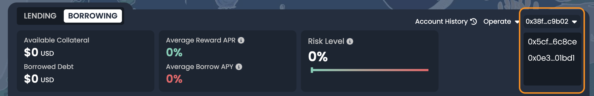

# 隔離資產

我們很高興宣布 Scallop 隔離資產池的正式上線！這項新功能是 Scallop 邁向全方位金融平台的重要一步，致力於為用戶提供更多功能，吸引下一批數百萬用戶加入。

<figure><figcaption></figcaption></figure>

## 什麼是隔離資產？

隔離資產功能將風險限制在特定的資金池內，確保壞賬不會影響其他資金池。

此功能允許協議支持更多元化的資產，而不會產生跨資金池的風險。

需要注意的是，當用戶借入隔離資產時，該債務本（obligation）下不能與其他債務共存，這意味著一次僅能借入一種類型的隔離資產。

## 隔離資產與非隔離資產的差異

借貸隔離資產需要更高的抵押比率，通常為 **200%**，即用戶需要提供至少兩倍於借款金額的抵押品。

此外，隔離資產的借貸費用為 **1%**，高於非隔離資產的費率。

## 如何借貸隔離資產

借貸隔離資產前，用戶需要先存入抵押資產。在單一債務本（obligation）下，如果用戶已經借入隔離資產，將無法借入其他資產。

實際舉例：

Alice 存入了多種抵押資產（例如 USDC 和 USDT）。當 Alice 借貸隔離資產 $FUD 後，便無法再借入其他資產，例如 SUI、ETH，甚至另一個隔離資產 $DEEP。若 Alice 希望借貸其他資產，必須先還清她的 $FUD 債務，才能再借入包括 $DEEP 在內的其他資產。

## 借貸隔離資產的最佳方法

最好的方法是使用多個債務本（**multiple obligations**）。通過創建一個新債務本，Scalloper可以保留現有的倉位，無需對其進行任何操作。

<figure><figcaption></figcaption></figure>

創建新債務本後，Scalloper可以在新債務本和現有債務本之間切換。在新債務本中存入抵押資產後，便可以借貸隔離資產。

<figure><figcaption></figcaption></figure>

## 馬上開始借貸隔離資產！

Scallop 很高興為用戶引入更多元化的資產。敬請期待更多隔離資產即將在 Scallop 上線！
