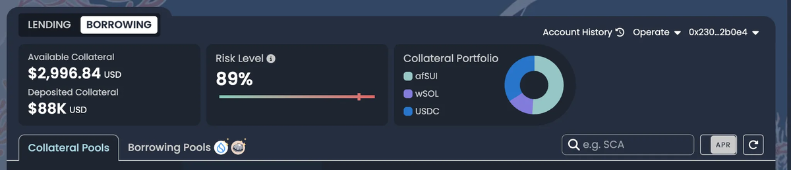

# 清算

## 前言

當借款人的抵押品價值跌破維持貸款所需的最低門檻時，即會觸發清算。這種情況可能由於抵押品價值下跌或借出資產價值上升所致。

在深入探討 Scallop 的清算機制之前，首先需要了解平台上清算的核心概念。Scallop 的設計旨在透過高效、精準且使用者友好的清算流程，將對借款人的影響降至最低，同時保障協議的整體穩定性。

## 軟清算

與其他協議不同的是，當用戶的倉位變得不健康時，其他協議的清算者會自動將用戶的所有抵押品出售以償還借款人的債務；而 Scallop 採取了更為友好的做法。

在 Scallop 中，清算者僅會出售足夠覆蓋超出門檻部分債務的那一小部分抵押品，確保用戶頭寸回到健康狀態。如果在部分償還後頭寸仍未達到健康水準，清算過程將會繼續，逐步出售抵押品，直到用戶頭寸完全恢復為止。

這種方式在維護借貸協議完整性的同時，將對用戶的影響降到最低，最大程度地保留了他們的抵押品。

## 風險水平

風險等級作為一個閥值：當風險等級低於 100% 時，表示借款人的倉位處於安全狀態；而當風險等級達到或超過 100% 時，則意味著借款人的債務已超出安全限度，可能觸發清算以維護協議穩定性。該指標為用戶提供了一種清晰且可操作的方式，以便即時監控借貸狀況並有效管理風險。

<figure><figcaption>
債務倉位組合
</figcaption></figure>

你可能想知道 Scallop 是如何計算這個風險等級的值。以下是我們計算風險等級的方法：

### 借款者抵押品

| 代幣   | 價格 | 抵押數量 | 清算因子 |
| ---- | -- | ---- | ---- |
| USDC | $1 | 1000 | 90%  |
| SUI  | $1 | 500  | 80%  |


抵押品價值：$1,500\
所需抵押品：$1,300 (代幣價值\*清算因子)


### 借款者當前債務

| 代幣   | 價格   | 借款數量 | 借款權重 |
| ---- | ---- | ---- | ---- |
| SCA  | $0.5 | 1000 | 100% |
| USDT | $1   | 500  | 100% |


加權借款值：$1,000\
風險水平 = 加權借款值 / 所需抵押品\
當前風險水平 = 76%


以上例子展示 Scallop 如何計算風險水平。

## 抵押參數

以下是適用於在 Scallop 進行清算的主要清算參數：

### 清算罰金

遭受清算的借款人需支付一筆罰金，具體比例依各借貸池設定而異。當出售抵押品時，系統會先扣除該罰金。例如，若清算罰金為 10%，出售價值 100 美元的抵押品時，90 美元（100 × (1 − 10%)）將用於償還債務，剩餘的 10 美元則歸入「清算儲備因子」。

### 清算儲備因子

清算儲備因子即清算罰金中歸入 Scallop 金庫（treasury）的那部分。例如，當罰金為 10%、清算獎勵為 5% 時，清算者以 95 美元購買市值 100 美元的抵押品，其中 90 美元用於償還借款人債務，另有 5 美元作為儲備進入金庫。

### 清算獎勵

為鼓勵清算者及時參與，Scallop 給予折價購買抵押品的獎勵。舉例來說，若清算獎勵為 5%，清算者可以按市價的 95% 收購抵押品。此激勵機制有助於促進迅速且高效的清算操作。

### 清算因子

清算因子設定了一個門檻，用以限制用戶可針對其抵押品所承擔的最大債務額度。


例子:

SUI 清算因子：80%、USDC 清算因子：90%\
若用戶有 100 USDC 和等值 200 美元的 SUI 作為抵押，則各項資產的清算門檻計算如下：

* USDC 抵押門檻：\
  100 USDC × 0.9 = 90 美元
* SUI 抵押門檻：\
  200 美元 × 0.8 = 160 美元

將兩者相加後，總抵押門檻為 90 + 160 = 250 美元。\
若用戶的借款餘額超過 250 美元，即達到清算條件，可被觸發清算機制。


## 清算場景

在一個假設的情境中，Kris提供了$10,000的USDC作為抵押品，並借入價值$8,500的SUI (USDC的抵押係數為85% )。如果SUI的價值短時間內上漲了6%，達到約$9,010，風險水平 (債務金額 / 抵押品 \* 清算因子)從94.4% (8,500 / 10,000 \* 90%)上升至100.1% (9,010 / 10,000 \* 90%)，Kris的帳戶將會啟動軟清算，將其風險水平降至100%。

在這次清算事件中，清算者替借款者償還了約 11%的SUI借款，金額為$1,000，使其債務大小降至 $8,010。抵押品總共被清算$1,100 的USDC，其中包含債務償還、清算儲備金(5%)、清算獎勵(5%)。

經過清算後，Kris剩下$8,900的USDC ($10,000 - $1,100) 和 $8,010的未償還 SUI 貸款 ($9,010 - $1,000)。另一方面，清算者支付了價值 $1,000的SUI，並收到了$1,050的USDC，從而獲利$50。

由於清算，Kris的清算閾值 (風險水平) 從100.1%降低到100%，若SUI價格再度上升，將持續觸發清算，使風險水平控制在100%。

## 清算指引

在特定情況下，當借款人的風險水平超過 100% 時，將會發生清算，這是由於存款或抵押品價值不足以覆蓋貸款所引起的。當抵押品的價值下降或借款的債務價值相對上升時，這種情況就會發生。

為了避免清算，保持對您的風險水平的關注並確保賬戶中有足夠的保證金至關重要。如果您的風險水平意外上升，您可以通過增加抵押資產或償還貸款來減輕風險。此外，您可以在我們的應用中訂閱通知，當您的存款面臨風險時，您能通過電子郵件或 SMS 接收追蹤和警報。

Scallop 的 「 軟清算機制 」 旨在確保即使抵押品價值下降，貸款人仍然受到保護。這也為借款人提供了一個機會，可以在抵押品被完全清算之前糾正情況，從而最大限度地減少他們的損失。

需要注意的是，Scallop 的清算機制的具體細節可能會進行變更或更新。因此，建議您隨時關注協議變更的最新公告。
