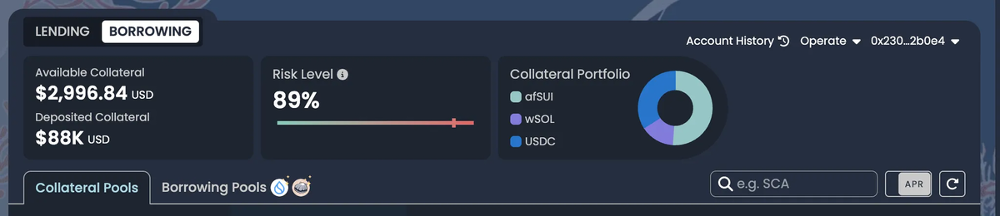

# 清算

### 概述

與許多借貸協議中清算者可以一次性賣出用戶全部抵押品不同，Scallop 採用了更友善的方式。Scallop 使用**軟清算**機制，清算者每次清算最多只能償還借款人**總債務的 20%**，並以折扣價獲得借款人的部分抵押品作為回報。這種漸進式的流程將對借款人的影響降到最低，在維持協議償付能力的同時，盡可能保留借款人的抵押品。

如果一次部分清算後，倉位仍處於不健康狀態，清算過程可以逐步重複進行，直到借款人的倉位完全恢復至健康狀態。

### 風險等級：何時會觸發清算？

<figure><figcaption></figcaption></figure>

Scallop 透過比較以下兩個數值來評估每位借款人的倉位狀態：

* **加權債務價值（Weighted Debt Value）**：您所有借款的美元總值，並依據各資產的 `borrow_weight` 進行調整。借款權重越高的資產，對您倉位的影響越大。
* **清算用抵押品價值（Collateral Value for Liquidation）**：您存入的抵押品美元總值，依據各資產的 `liquidation_factor` 進行調整。此數值決定了您的抵押品在觸發清算前能支撐多少借款。

您的風險等級（Risk Level）反映的是這兩個數值之間的比率。當風險等級低於 100% 時，您的倉位是安全的。當風險等級達到或超過 100%，代表您的加權債務價值已超過清算用抵押品價值，您的倉位將面臨清算。

Scallop 上每種資產都有各自的風險參數，因此您的抵押品和債務組成非常重要。舉例來說，以低 `liquidation_factor` 的抵押品去借入高 `borrow_weight` 的資產，會比更保守的配置更容易接近清算門檻。

### 軟清算

Scallop 的軟清算機制旨在保護借款人，避免其在單次事件中失去全部抵押品。

**運作方式：**

* 每次清算最多可償還借款人**總債務價值的 20%**（涵蓋所有債務類型）。此上限可防止單次清算造成過多的抵押品損失。
* 若一次清算後倉位仍不健康，可以繼續進行額外的清算，每次仍限制在剩餘總債務的 20%，直到倉位恢復健康。
* 對於非常小的倉位（總債務低於 **$10**），允許在單次清算中全額償還。這類「微量（dust）」倉位太小，無法以經濟的方式進行逐步清算。

這種逐步清算的方式大幅降低了連鎖壞帳的風險，避免單次大額清算進一步破壞倉位的穩定性。

### 清算罰款與獎勵

當清算發生時，借款人的抵押品會被扣押，並分配給清算者和協議：

**對借款人而言：** 您的被扣押抵押品會產生一筆**清算罰款（Liquidation Penalty）**。罰款比率依抵押品類型而異，由治理機制設定，最高為 20%。這意味著如果您被清算，您損失的抵押品會略多於替您償還的債務金額。

**對清算者而言：** 清算者會獲得清算折扣（Liquidation Discount）作為獎勵，即以低於市場價格的方式取得借款人的抵押品。例如，在 5% 的清算折扣下，清算者實際上以 $95 的債務償還獲得價值 $100 的抵押品。最高折扣為 15%。

**對協議而言：** 清算罰款與清算折扣之間的差額會作為收入流入協議。例如，若罰款為 8%、折扣為 5%，協議將獲得被扣押抵押品價值的 3%。

各抵押品類型的關鍵參數如下：

| 參數                         | 說明                                    | 最大值 |
| -------------------------- | ------------------------------------- | --- |
| 清算因子（Liquidation Factor）   | 您的抵押品價值中有多少比例計入清算門檻。數值越高，距離清算的緩衝空間越大。 | 95% |
| 清算折扣（Liquidation Discount） | 清算者取得您抵押品時享有的折扣。數值越高，對清算者的激勵越大。       | 15% |
| 清算罰款（Liquidation Penalty）  | 對您被扣押抵押品施加的總罰款。罰款始終 ≥ 折扣。             | 20% |

請注意，借款人的債務會按**全額償還金額**進行減少。協議的收入份額來自抵押品端，而非債務償還端。這意味著借款人在每次清算中都能獲得最大程度的債務減免。

### 誰可以執行清算？

Scallop 上的清算是**無需許可的（Permissionless）**。任何人都可以清算不健康的倉位，不需要白名單或特殊權限。這種開放設計確保不健康的倉位能被及時處理，維持協議的償付能力。

清算者通常運行自動化機器人來監控倉位，並在有利可圖時執行清算。如果您有興趣運行清算機器人，請參閱[清算功能](https://docs.scallop.io/integrations/contract-integration/liquidation-function)整合指南以獲取技術細節。

### 如何避免被清算

您可以透過積極管理倉位來保護自己免於清算：

* **監控您的風險等級（Risk Level）：**&#x5728; Scallop 儀表板上，當您的加權債務接近清算加權抵押品價值時，代表您已處於風險中。
* **增加抵押品：**&#x64F4;大您的債務與清算門檻之間的緩衝空間。
* **償還部分債務：**&#x964D;低您的加權債務價值。
* **注意資產選擇**：清算因子較高的抵押品資產能提供更大的緩衝空間，而借款權重較高的借入資產則會讓您更快接近清算門檻。
* **留意市場波動**：抵押品價格下跌或債務代幣價格上漲，都可能在您未改變倉位的情況下將您推向清算。

