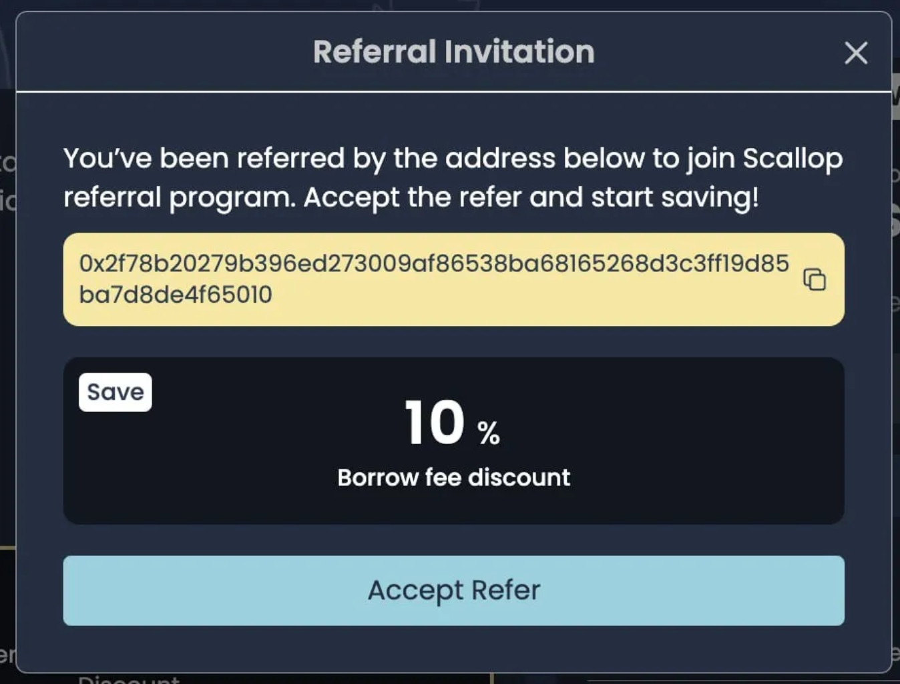

# 推薦碼

Scallopers 可以生成專屬的推薦連結並分享給他人以邀請新用戶加入。當新用戶通過推薦連結加入 Scallop 並在 Scallop 上創建obligation key時，該obligation key將通過推薦人的錢包地址與推薦人聯接。

需特別注意，一旦接受了推薦連結，將無法解除與該推薦連結的綁定！

## 推薦計畫的好處

被推薦人從 Scallop 資金池借款時，推薦者將獲得部分借款手續費的分成。分成比例取決於推薦人持有的 veSCA 數量。\
被推薦人在從 Scallop 借款時，最高可以享受 **20% 的借款手續費折扣**。

**Tier-Based Rates**

<figure><figcaption></figcaption></figure>

## 範例

假設 Scalloper A 持有 1,000,000 veSCA，並生成一個推薦連結給 Scalloper B。

* **Scalloper A** 有資格獲得 **40% 的借款手續費分成**。
* **Scalloper B** 使用 Scalloper A 的推薦連結，能享受 **20% 的借款手續費折扣**。

Scalloper B 借款 $1,000，計算如下：

1. **基礎借款手續費**：$1,000 × 0.3% = **$3**
2. **Scalloper B 實際支付的手續費**：$3 × (100% - 20%) = **$2.4**
3. **推薦人 Scalloper A 的分成**：$3 × 40% = **$1.2**

如此一來，Scalloper B 借款手續費減少，Scalloper A 獲得借款分成，雙方皆受益。

## 開始使用Scallop推薦碼！

## 如何推薦：

**步驟 1**：前往 Scallop 平台的 **「推薦賺取」(Refer & Earn)** 頁面。

<figure><figcaption>
Referral Page: <a href="https://app.scallop.io/referral">https://app.scallop.io/referral</a>
</figcaption></figure>

**步驟 2**：點擊 **「開始賺取」(Start Earning)** 以生成您的專屬推薦連結。

會需要同意一個transaction。

<figure><figcaption></figcaption></figure>

步驟 3：一旦連結生成，便可以複製並分享鏈接來開始賺取分成！ 還能夠查看當前符合條件的借款費用折扣和借款費用分成。

<figure><figcaption></figcaption></figure>

## 如何接受推薦連結：

&#x20;進入推薦連結後，系統會顯示接受邀請。只需點擊「接受推薦」即可加入 Scallop。

<figure><figcaption></figcaption></figure>

一旦接受，就可以看到帳戶將綁定到的推薦人代碼！請注意，接受推薦代碼後，將無法解除綁定。

## 馬上加入Scallop推薦計畫！

通過參加 Scallop 推薦計劃，不僅可以賺取獎勳，還能幫助我們的社群成長。質押 SCA 並開始分享你的推薦連結吧！
