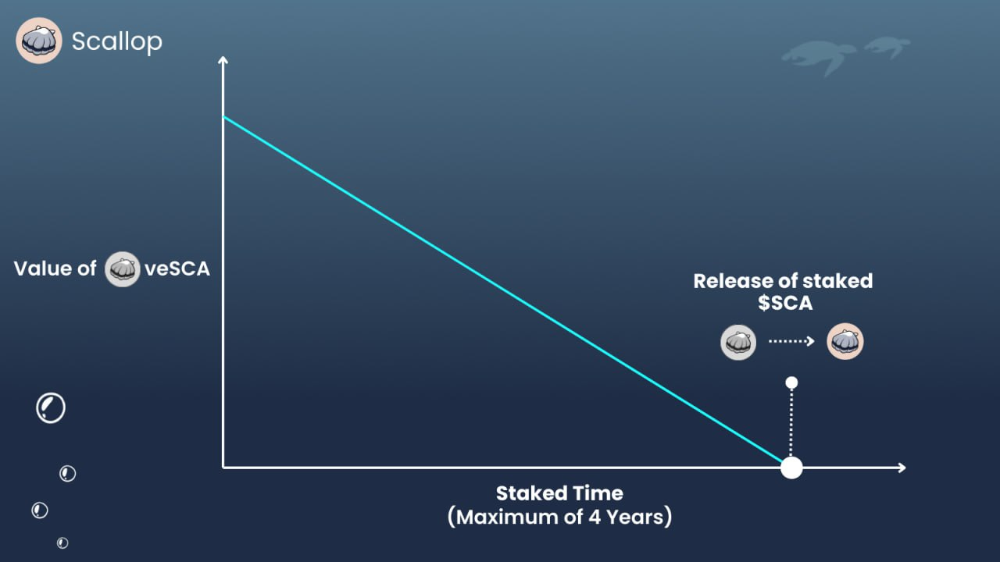

# veSCA

Scallop 採用一種被普遍稱為Vesting Model的 $SCA 代幣的鎖定機制，其衍生品為 veSCA，通過持有 veSCA，擁有者可以解鎖持有 $SCA的好處，讓代幣變得更加有用。

veSCA 有助於減少流通的 $SCA 代幣數量，增強去中心化與市場恆定性，有助於穩定代幣的價值，並加強整個 Scallop 平台的穩定性。這種方法對於確保 Scallop 的成功和長期發展至關重要。

### 持有veSCA的好處

1. 治理 & 投票
2. SCA代幣獎勵加乘
3. 加入扇貝忠誠計畫
4. 獲得更高的推薦碼折扣/分潤等級

***

### 怎麼取得veSCA?

僅需要鎖定您的 SCA 即可獲得 veSCA.

您收到的 veSCA 數量與您鎖定的 SCA 數量和鎖定的持續時間成正比。您的 veSCA 數量會隨著時間逐漸減少，並在鎖定期結束後降至零。鎖定的 SCA 屆時將會全部解鎖。\

<figure><figcaption>
veSCA 衰減圖
</figcaption></figure>

您可以通過選擇延長質押期限和/或增加質押數量來提高您的 veSCA 數值。

<figure><figcaption></figcaption></figure>

鎖定時間越久，會獲得越多 veSCA 。

#### veSCA 公式

$$
veSCA = SCA \times (RemainLockPeriod  \div4 Years)
$$

#### **鎖倉規則**

* 解鎖日期僅在每天的 UTC 時間凌晨 12 點發生。因此，用戶需要選擇這個解鎖日期。
* 每輪持續一天（24 小時）。
* 用戶需要至少鎖定一整輪。例如，如果他們在 UTC 時間中午 12 點開始，他們不能在下一個 UTC 時間凌晨 12 點（即 12 小時後）解鎖，因為這還不算一整輪。在這種情況下，用戶需要鎖定超過一天的時間，以達到至少一整輪。
* 最低鎖定輪數為 1，最高鎖定輪數為 1460。最高輪數相當於 4 年。

#### **鎖定更多 SCA**

* 如果用戶在不更改鎖定期限的情況下增加他們的 SCA 質押，這也會刷新他們的 veSCA 數量。

**延長鎖定期**

* 用戶可以選擇更長的鎖定期限，屆時用戶的 veSCA 值將被重新計算。鎖定期限不能縮短。

#### **贖回** veSCA

* 用戶在鎖定結束後可以 100% 取回 SCA 。

***

## veSCA 用途

### 持有 veSCA 加乘收益 

* 用戶可以通過持有 veSCA 來提高他們的收益。當他們將資金存入提供激勵的池中時，需要持有 veSCA。例如，如果一個池子為存入流動性提供 20% 的年利率（APR），持有一定數量的 veSCA 可以提供增益，例如最高可達 5 倍。最初的年利率是 20%，在經過 5 倍增益後，年利率將變為 100%。
* 用戶獲得的增益數量取決於他們持有的 veSCA 的比例份額。用戶擁有的流動性越多，他們所需的 veSCA 也越多。


如果您的加乘值（Boost Value）顯示不正確，這意味著它尚未刷新。當您進行借款、供應、還款、質押 SCA 或延長鎖定期限等操作後，它將會更新。或者，您也可以通過訪問質押頁面並點擊“刷新加乘”（Refresh Boost）按鈕來手動刷新您的增益值。


_計算收益權重的公式_

<figure><figcaption></figcaption></figure>

\
&#xNAN;_&#x8A08;算收益加乘的公式。您獲得的收益百分比。最低為 100%，代表基礎收益。_

<figure><figcaption></figcaption></figure>

現在，讓我們來計算您將獲得的 APR

\

$$
EarningAPR = PoolIncentiveAPR \times EarningBoost
$$

讓我們模擬不同的情境來證明 veSCA 數量和幣量（coinAmount）之間的相關性。假設 veSCA 的總供應量為 500,000。

<figure><figcaption></figcaption></figure>

上表說明了當用戶的供應量增加時，需要增加 veSCA 的數量，以維持收益年利率（APR），否則 APR 將會下降。

### &#x20;veSCA 加乘收益計算機 

<figure><figcaption></figcaption></figure>

我們還提供了支持讀取你當前持有艙位並且模擬持有veSCA數量的veSCA 加乘收益計算機，以便您在鎖定SCA之前可以先行做更多評估。\
\
&#x20;veSCA 加乘收益計算機: [https://app.scallop.io/vesca](https://app.scallop.io/vesca)

<figure><figcaption></figcaption></figure>

### 扇貝忠誠計畫 (2024第二季)  

忠誠度計畫旨在在我們達到某些收入里程碑時獎勵用戶。在每個里程碑，我們都會進行代幣回購，將這些代幣分發給持有 veSCA 的用戶。

我們曾經進行過的忠誠計畫: [https://medium.com/scallopio/search?q=Loyalty](https://medium.com/scallopio/search?q=Loyalty)\

### 治理 (2025第一季) 

Scallop 的治理機制，也稱為 veSCA，將有助於實現更高程度的去中心化。

