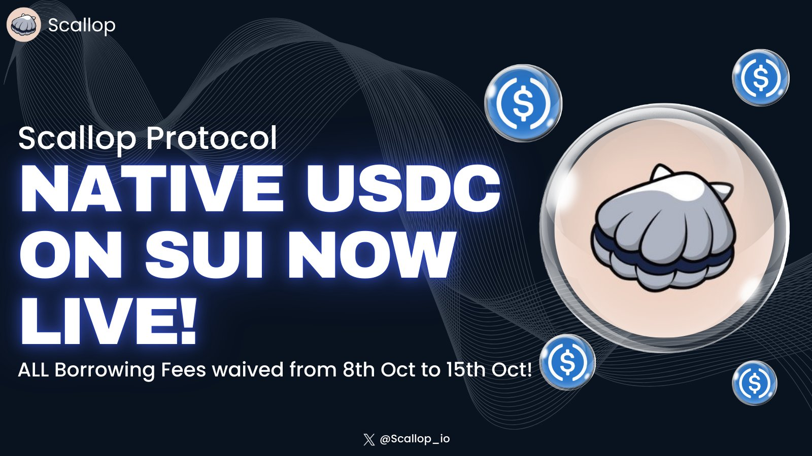
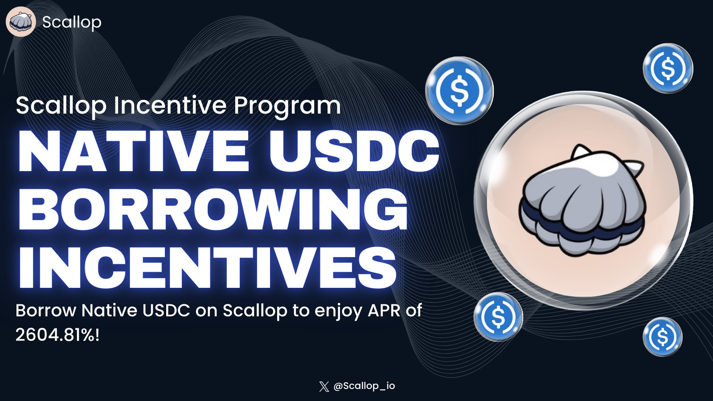
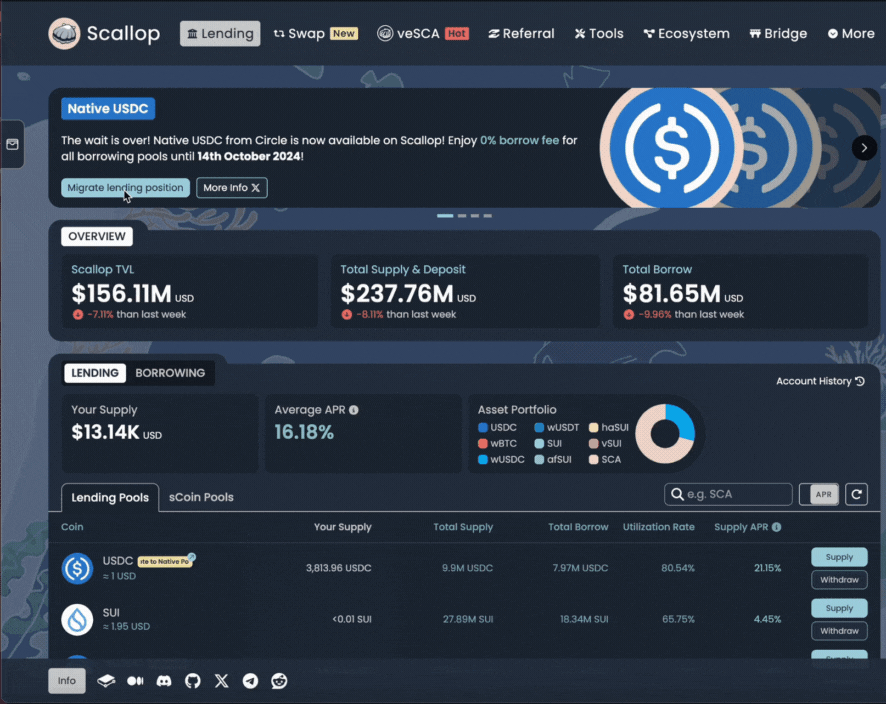
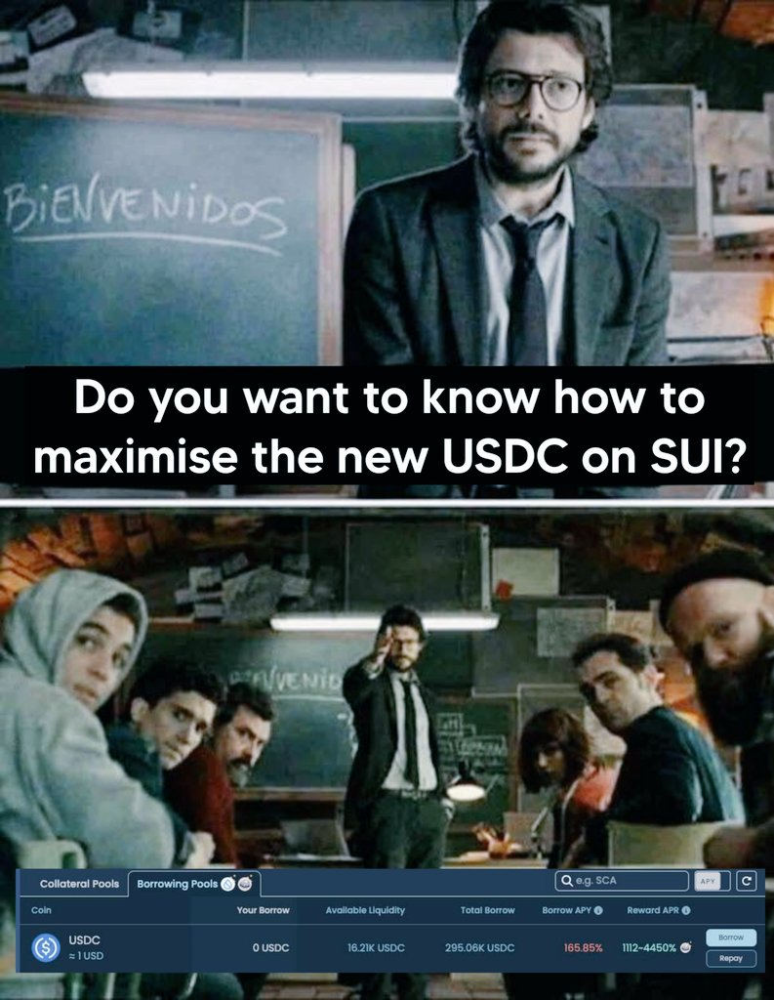

# 原生 USDC

原生 USDC 登陸 SUI 網絡是一個備受期待的里程碑，象徵著 SUI 區塊鏈生態系的重大擴展。Scallop 作為這次發展的有力支持者，從一開始便整合了原生 USDC，讓用戶能夠立即在 Scallop 上借貸原生 USDC。

<figure><figcaption>
原生 USDC 在 Scallop 上線
</figcaption></figure>

為慶祝並支持原生 USDC 登陸 SUI 生態系，Scallop 正為進行借貸的用戶提供特別激勵。不僅如此，我們還免除了借貸手續費——原先設定為 0.3%，在此次特別活動期間降為 0%。這次免手續費借貸活動將從 2024 年 10 月 8 日持續至 10 月 15 日，無論是 veSCA 持有者還是非持有者，都能有平等的機會透過在 SUI 上引入的原生 USDC 來最大化自己的回報。

<figure><figcaption>
原生 USDC 激勵措施
</figcaption></figure>

此外，Scallop 意識到原生 USDC 在 SUI 上線的重要性，特別開發了一項無縫遷移功能。這款由我們專業開發團隊打造的先進工具，讓 wUSDC 貸款池中的用戶能輕鬆遷移到原生 USDC 池中，免去手動提取、將 wUSDC 兌換為 USDC，再重新存入貸款池的繁瑣過程，使整個遷移過程更加快速且無縫順暢。

<figure><figcaption></figcaption></figure>

<figure><figcaption></figcaption></figure>
